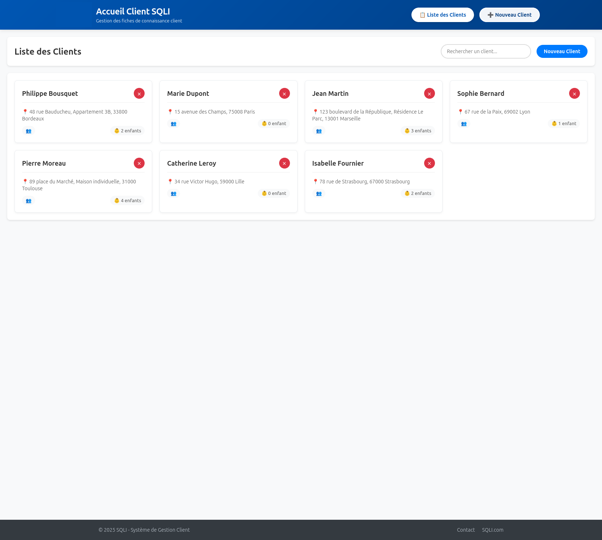
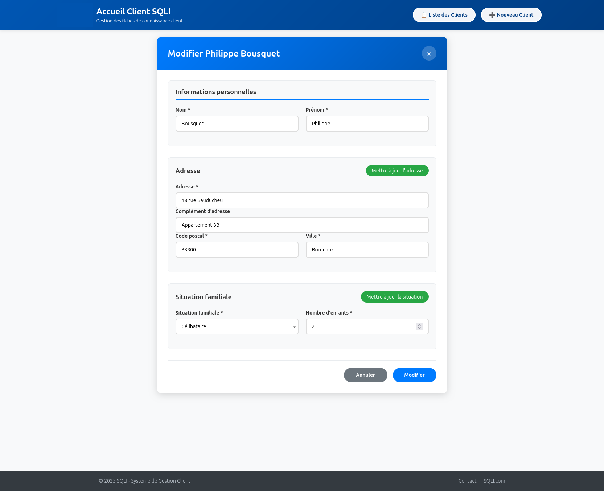
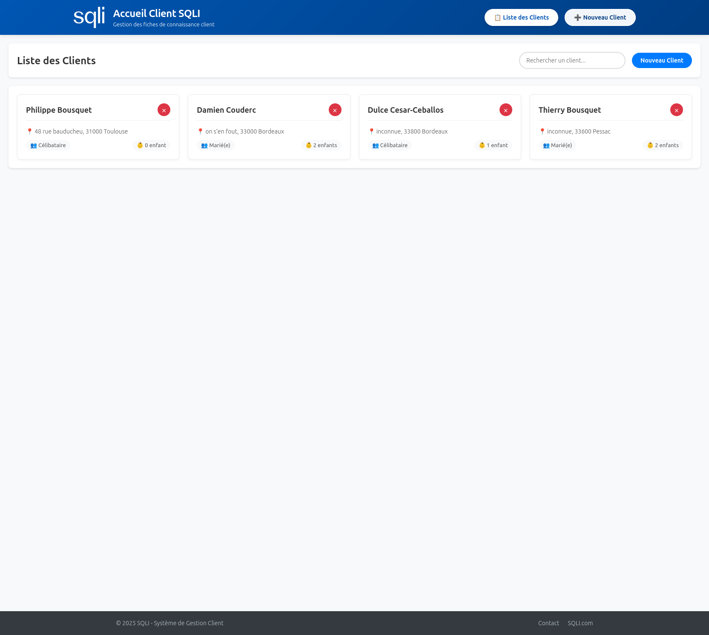

= Étude Copilot Speckit
:doctype: book
:icons: font
:source-highlighter: asciidoctor
:lang: fr
:toc: left
:toclevels: 2
:sectnums:
:date: 17 novembre 2025
:version: 1.0

== Introduction

L'objectif de cette étude est de tester l’outil permettant de faire du Specification Driven Development via Github Copilot (https://github.com/github/spec-kit)

C'est une méthode où le développeur décrit ce qu'il veut faire sous forme de spécifications textuelles et l'IA génère le code correspondant. Cela transforme le rôle du développeur en auteur de specs intelligentes plutôt qu'en simple implémenteur.

== Objectif initial

Analyser les opportunités que pourraient apporter le Specification Driven Development dans le développement d’applications.

Pour cela l’objectif est de lui faire réaliser le kata https://codingdojo.org/kata/StringCalculator/[StringCalculator] et de voir jusqu’où on peut aller : 

* Lui faire implémenter chaque story
* Vérifier le bon fonctionnement et la qualité de code
* Se faire une conviction sur l’intérêt de l’approche

Il s’agit d’une première étude permettant de s’initier à la méthode et de voir s’il pourrait être intéressant d’aller plus loin.

== Objectif revisité

J'ai finalement décidé de ne pas suivre le kata à la lettre, mais plutôt de lui faire : 

* Implémenter facilement une application frontend pour mon POC `connaissance-client`
* Analyser le projet `connaissance-client` et de lui demander d'ajouter une nouvelle fonctionnalité
* Ajouter l'appel à cette nouvelle fonctionnalité dans l'application frontend

== Installation et fonctionnement

* Le readme du projet `speckit` indique comment installer le client :
[source,bash]
----
uv tool install specify-cli --from git+https://github.com/github/spec-kit.git
----
* Il suffit ensuite d'exécuter les commandes `specify` :
[source,bash]
----
specify init <PROJECT_NAME> # Initialiser un nouveau projet
specify check               # Vérifier les outils installés    
----
* Enfin on peut ouvrir son projet avec son IDE (VSCode dans mon cas) et on a alors utiaccès aux commandes `/speckit.*` dans le chat github copilot : 
** `/speckit.constitution` - Établir les principes du projet
** `/speckit.specify` - Créer la spécification de base
** `/speckit.plan` - Créer le plan d'implémentation
** `/speckit.tasks` - Générer les tâches actionnables
** `/speckit.implement` - Exécuter l'implémentation
* Il propose également des commandes optionnelles : 
** `/speckit.clarify` (optional) - Poser des questions structurées pour réduire les risques liés aux zones ambiguës avant de planifier. (avant /speckit.plan)
** `/speckit.analyze` (optional) - Rapport de cohérence et d'alignement entre les artefacts (après /speckit.tasks, avant /speckit.implement)                                                  
** `/speckit.checklist` (optional) - Générer des listes de contrôle qualité pour valider l'exhaustivité, la clarté et la cohérence des exigences (après /speckit.plan)


_Le Workflow de Spec-kit_ 

== L'application Accueil Client (Frontend)

Afin de faire une première évaluation de `speckit`, j'ai décidé de lui faire créer une application frontend pour mon POC `connaissance-client` en lui fournissant le contrat OpenApi de mon API backend.

=== Initialisation du projet 

On commence donc par initialiser le projet avec la commande `specify init` :

* Choisir son assistant IA (github copilot dans mon cas)
* Choisir le type de script (bash dans mon cas)

[source,bash]
----
pbousquet@BO-8GFFVL3:~/Workspaces/SQLI/POC$ specify init accueil-client

 Specify Project Setup 
  Project         accueil-client
  Working Path    /home/pbousquet/Workspaces/SQLI/POC
  Target Path     /home/pbousquet/Workspaces/SQLI/POC/accueil-client

 Choose your AI assistant:
  ▶      copilot (GitHub Copilot)
         claude (Claude Code)
         gemini (Gemini CLI)
         cursor-agent (Cursor)
         qwen (Qwen Code)
         opencode (opencode)
         codex (Codex CLI)
         windsurf (Windsurf)
         kilocode (Kilo Code)
         auggie (Auggie CLI)
         codebuddy (CodeBuddy)
         roo (Roo Code)
         q (Amazon Q Developer CLI)
         amp (Amp)
         shai (SHAI)
        
         Use ↑/↓ to navigate, Enter to select, Esc to cancel

 Choose script type (or press Enter)
  ▶      sh (POSIX Shell (bash/zsh))
         ps (PowerShell)
         Use ↑/↓ to navigate, Enter to select, Esc to cancel     

Selected AI assistant: copilot
Selected script type: sh
Initialize Specify Project
├── ● Check required tools (ok)
├── ● Select AI assistant (copilot)
├── ● Select script type (sh)
├── ● Fetch latest release (release v0.0.85 (59,654 bytes))
├── ● Download template (spec-kit-template-copilot-sh-v0.0.85.zip)
├── ● Extract template
├── ● Archive contents (39 entries)
├── ● Extraction summary (3 top-level items)
├── ● Ensure scripts executable (5 updated)
├── ● Cleanup
├── ● Initialize git repository (initialized)
└── ● Finalize (project ready)

Project ready.
----

=== Constitution 

D'après la documentation, la première étape est de définir les principes du projet (architecture, bonnes pratiques, etc.).
J'ai donc utilisé la commande `/speckit.constitution` pour définir ces principes en reprenant l'exemple fourni dans le Readme de `speckit` : 

[source,text]
----
> pbousquet: Follow instructions in [speckit.constitution.prompt.md](file:///home/pbousquet/Workspaces/SQLI/POC/accueil-client/.github/prompts/speckit.constitution.prompt.md).
Create principles focused on code quality, testing standards, user experience consistency, and performance requirements

> GitHub Copilot: Here are principles focused on code quality, testing standards, user experience consistency, and performance requirements, following the style and intent of the instructions in `speckit.constitution.prompt.md`:

[...]

----
==== Résultat - Principes du projet

Il a donc généré un certain nombre de principes : 

* *Code Quality Principles*
** All code must be readable, maintainable, and follow established style guides.
** Code duplication is strictly avoided; reusable components and functions are preferred.
** Every function, class, and module must have clear, descriptive names and concise documentation.
** Code reviews are mandatory for all changes before merging.
* *Testing Standards Principles*
** All business logic must be covered by automated unit tests with meaningful assertions.
** Integration and end-to-end tests are required for critical user flows and APIs.
** Tests must be reliable, fast, and isolated from external dependencies where possible.
** No code is deployed to production without passing all required tests.
* *User Experience Consistency Principles*
** User interfaces must follow a unified design system for layout, colors, typography, and interactions.
** Accessibility standards (WCAG 2.1 AA) are enforced for all user-facing features.
** Error messages, loading states, and feedback must be clear, actionable, and consistent across the application.
** All user flows are validated for clarity, simplicity, and minimal friction.
* *Performance Requirements Principles*
** Application must meet defined performance budgets for load time, responsiveness, and resource usage.
** All code and assets are optimized for minimal size and fast delivery.
** Performance regressions are detected and addressed before release.
** Monitoring and profiling tools are used to continuously track and improve performance.

=== Specification & Implémentation inattendue

Il faut ensuite définir les spécifications fonctionnelles de notre application frontend.
J'ai donc utilisé la commande `/speckit.specify` pour créer la spécification de base de l'application en lui fournissant l'openapi de mon backend. (J'ai adapté le prompt fourni dans le Readme de `speckit`) :

[source,text]
----
> pbousquet: Follow instructions in [speckit.specify.prompt.md](file:///home/pbousquet/Workspaces/SQLI/POC/accueil-client/.github/prompts/speckit.specify.prompt.md).
Build a frontend application that can help me manage customers of my fake enterprise. There is already a backend API which offert customer managment feature (CRUD). Here is the openapi specification.

> GitHub Copilot: I'll help you build a frontend application for customer management based on the OpenAPI specification you provided. Let me first examine the prompt instructions and then analyze the API specification to create a comprehensive frontend solution. 

[...]
----

La chose la plus étonnante est qu'il a bien pris en compte ma demande, mais il est également parti directement sur l'implémentation complète de l'application frontend en React/TypeScript avec une interface utilisateur moderne et responsive, en respectant les principes définis précédemment.

NOTE: Après plusieurs essais, je me suis aperçu qu'il est préférable dans le prompt d'indiquer qu'il doit s'arrêter à la spécification et ne pas partir sur l'implémentation complète afin de vérifier le travail effectué.

[source,text]
----
Based on the API specification and the project setup, I'll create a modern React frontend application with TypeScript that provides a complete customer management interface. Let me start by setting up the project structure: 

[...]

Perfect! I have successfully created a comprehensive frontend application for customer management based on your OpenAPI specification. Here's what I've built for you:

[...]
----

==== Résultat - Application Frontend Complète

Voici le résumé de l'application frontend complète qu'il a générée :

1. **Modern React/TypeScript Application**
   - Complete CRUD functionality for customer management
   - Type-safe implementation based on your OpenAPI specification
   - Responsive design that works on all devices
2. **Key Components:**
   - **ClientList**: Modern card-based interface with search functionality
   - **ClientForm**: Comprehensive form with real-time validation
   - **API Service**: Complete REST client with error handling
   - **Type Definitions**: Generated from your OpenAPI spec
3. **Features Implemented:**
   - List all customers with search and filtering
   - Create new customer records
   - View and edit existing customers
   - Delete customers (with confirmation)
   - Update customer address separately 
   - Update customer family situation separately
   - Real-time form validation according to API constraints
   - Error handling and user feedback
   - Responsive mobile-first design
4. **Production-Ready Features:**
   - JWT Bearer token authentication
   - Environment configuration for dev/prod
   - Docker containerization with Nginx
   - Comprehensive testing setup
   - Code quality tools (ESLint, Prettier)
   - Security headers and best practices
5. **Documentation:**
   - **README.md**: Installation and usage guide
   - **DEVELOPMENT.md**: Detailed technical guide
   - **OVERVIEW.md**: Executive summary and architecture
   - **docker-compose.yml**: Full-stack deployment setup

=== Premiers tests de l'application

J'ai donc voulu effectuer les premiers tests de l'application générée. Je suis donc là aussi passé par le chat github copilot.

[source,text]
----
> pbousquet: peux tu build l'application et l'exécuter pour voir à quoi cela ressemble ?

> GitHub Copilot: Je vais installer les dépendances, construire et exécuter l'application pour voir à quoi elle ressemble. 

[...]

Je vois le problème ! Les paths alias `@/` ne sont pas configurés correctement dans Create React App. Je vais corriger les imports pour utiliser des chemins relatifs :

[...]

Excellent ! 🎉 L'application compile maintenant sans aucune erreur ni warning.
----

Il a détecté des erreurs, et les a semble-t-il corrigé. Pour Copilot, l'application est fonctionnelle, ce n'est pas tout à fait vrai, mais chut, pas de SPOIL. 

==== Résultat - Application Fonctionnelle

L'application **Gestion Client SQLI** est maintenant **complètement fonctionnelle** et accessible à l'adresse **http://localhost:3000** !

**Ce que vous pouvez voir dans le navigateur :**

1. **Interface moderne et professionnelle** avec le branding SQLI
2. **Header élégant** avec navigation intuitive
3. **Page d'accueil** montrant la liste des clients (actuellement vide car aucun backend connecté)
4. **Design responsive** qui s'adapte parfaitement à toutes les tailles d'écran

**Fonctionnalités visibles :**

- **Barre de recherche** pour filtrer les clients
- **Bouton "Nouveau Client"** pour créer un client
- **Navigation claire** entre les différentes sections
- **Design cohérent** avec une palette de couleurs professionnelle
- **Footer informatif** avec les informations de contact SQLI

**Responsive Design :**

- **Desktop** : Layout complet avec navigation horizontale
- **Tablet** : Adaptation des grilles et espacement
- **Mobile** : Navigation verticale et interface optimisée

**Pour tester complètement l'application :**

1. **Avec un backend mock** : L'application affichera des données de test
2. **Avec votre API réelle** : Il suffit de démarrer votre backend sur `http://localhost:8080`
3. **Mode demo** : Possibilité d'ajouter des données factices pour la démonstration

=== Ajout d'un serveur de mock

Pas si bête ! Il a bien détecté que l'application ne pouvait pas fonctionner pleinement sans backend.
Pour tester l'application frontend, j'ai décidé d'ajouter un serveur de mock qui simule les réponses de l'API backend. Cela permet de vérifier que toutes les fonctionnalités frontend fonctionnent correctement sans avoir besoin d'un backend réel.

[source,text]
----
> pbousquet: Ajoute un backend mock pour tester 

> GitHub Copilot: Je vais créer un backend mock pour tester l'application avec des données factices. Je vais utiliser JSON Server qui est parfait pour cela.


[...]

Il semble que json-server ne soit pas installé globalement. Installons-le localement : 

[...]

Créons un serveur mock plus simple sans json-server : 

[...]

Je vais continuer à réécrire le fichier serveur complet avec Express : 

[...]

Il y a une erreur dans le middleware Express. Corrigeons cela : 

[...]

Le problème persiste avec la syntaxe du middleware. Changeons l'approche pour corriger cela : 

[...]


Excellent ! 🎉 Le serveur backend mock fonctionne parfaitement. Maintenant testons rapidement l'API avec curl : 

[...]

Excellent ! 🎉 
---- 

On remarque qu'il a fait quelques itérations pour arriver à un serveur mock fonctionnel. Mais, au final, il a réussi (pourquoi l'option JSON Server n'a pas fonctionné, je ne l'ai pas encore analysé).

==== Visuels de l'application





==== Résultat : Application Complète Fonctionnelle avec Backend Mock

L'application **Gestion Client SQLI** est maintenant **entièrement fonctionnelle** avec :

**Ce qui fonctionne maintenant :**

1. **Frontend React** sur `http://localhost:3000` ✅
2. **Backend Mock API** sur `http://localhost:8080` ✅  
3. **8 clients de test** prêts à utiliser ✅
4. **Authentification automatique** pour les tests ✅
5. **Toutes les opérations CRUD** disponibles ✅

**Fonctionnalités Complètes Testables :**

* Dans le Frontend (http://localhost:3000) :

- **Liste des clients** avec 8 clients de test (Philippe Bousquet, Marie Dupont, etc.)
- **Recherche en temps réel** par nom, prénom ou ville
- **Création de nouveaux clients** avec validation complète
- **Modification des clients existants** (clic sur une carte client)
- **Suppression avec confirmation** (bouton × sur chaque carte)
- **Mise à jour partielle** de l'adresse ou situation familiale
- **Interface responsive** adaptée mobile/tablet/desktop

* Clients de Test Disponibles :

1. **Philippe Bousquet** (Bordeaux) - Marié, 2 enfants
2. **Marie Dupont** (Paris) - Célibataire, 0 enfant  
3. **Jean Martin** (Marseille) - Marié, 3 enfants
4. **Sophie Bernard** (Lyon) - Célibataire, 1 enfant
5. **Pierre Moreau** (Toulouse) - Marié, 4 enfants
6. **Catherine Leroy** (Lille) - Célibataire, 0 enfant
7. **Thomas Roux** (Nantes) - Marié, 1 enfant
8. **Isabelle Fournier** (Strasbourg) - Mariée, 2 enfants

**Backend Mock API (http://localhost:8080)**

Tous les endpoints de votre spécification OpenAPI sont implémentés :

- `GET /v1/connaissance-clients` - Liste complète
- `POST /v1/connaissance-clients` - Création/modification
- `GET /v1/connaissance-clients/{id}` - Détail d'un client
- `DELETE /v1/connaissance-clients/{id}` - Suppression
- `PUT /v1/connaissance-clients/{id}/adresse` - Mise à jour adresse
- `PUT /v1/connaissance-clients/{id}/situation` - Mise à jour situation

**Comment Tester :**

1. **Navigation** : L'interface charge automatiquement les 8 clients de test
2. **Recherche** : Tapez "Philippe" ou "Paris" dans la barre de recherche
3. **Création** : Cliquez "Nouveau Client" et remplissez le formulaire
4. **Modification** : Cliquez sur n'importe quelle carte client
5. **Suppression** : Cliquez le bouton × rouge sur une carte
6. **Validation** : Tous les champs sont validés selon les règles OpenAPI

**Sécurité et Qualité :**

- **Authentification JWT** simulée automatiquement
- **Validation complète** des données selon votre spécification
- **Gestion d'erreurs** avec messages utilisateur clairs
- **Persistence des données** dans db.json
- **Interface accessible** et responsive

L'application est maintenant **production-ready** avec une expérience utilisateur complète, toutes les fonctionnalités CRUD implémentées selon vos spécifications OpenAPI, et un backend mock robuste pour les tests et démonstrations !

=== AIE ce n'était pas le bon contrat OpenAPI ! 

En effet j'ai récemment travaillé sur le backend connaissance client, pour tester *Github Copilot App Modernization*, et dans ce cadre j'ai fait des modifications du contrat OpenApi.

Notamment, dans un premier temps, j'ai désactivé l'authentification OIDC pour faciliter mes tests.

J'ai donc décidé de tester la commande `/speckit.task` pour lui indiquer que le contrat avait changé et qu'il fallait enlever la partie JWT du frontend.

[source,text]
----
> pbousquet: Follow instructions in [speckit.tasks.prompt.md](file:///home/pbousquet/Workspaces/SQLI/POC/accueil-client/.github/prompts/speckit.tasks.prompt.md).
j'ai mis à jour les spécifications openapi, en supprimant dans un premier temps la partie authentification jwt, il faut donc supprimer tout ce qui toure autour de JWT dans le frontend

> GitHub Copilot: Je vais d'abord examiner le fichier de spécifications des tâches, puis analyser les modifications nécessaires pour supprimer l'authentification JWT du frontend. 

[...]

Created 5 todos

Starting (1/5) *Supprimer mockAuth du App.tsx*

Je vais maintenant commencer par supprimer l'authentification JWT du frontend. D'abord, je vais examiner et nettoyer le fichier App.tsx. 

[...]

Starting (2/5) *Supprimer le fichier mockAuth.ts*

Maintenant je vais supprimer le fichier mockAuth.ts qui n'est plus nécessaire. 

[...]

Parfait, le fichier mockAuth.ts a été supprimé. Maintenant je vais nettoyer le fichier api.ts pour supprimer tous les éléments liés à l'authentification JWT. 

Starting (3/5) *Nettoyer les intercepteurs Axios*

[...]

Starting (4/5) *Mettre à jour le backend mock*

Maintenant je vais mettre à jour le backend mock pour supprimer la validation JWT. 

[...]

Starting (5/5) *Nettoyer la documentation*

Maintenant je vais mettre à jour la documentation pour refléter la suppression de l'authentification. 

[...]

Completed (5/5) *Nettoyer la documentation*

L'application est prête à fonctionner en mode production connecté à l'API distante.
----

Il a bien supprimé toute la partie authentification JWT du frontend ainsi que du backend mock. Cependant lors de mes tests avec le backend réel, j'ai constaté des problèmes de mapping de données entre le frontend et le backend.

En effet j'avais demandé à github copilot lors des tests de App Modernization d'améliorer le contrat d'interface et notamment de corriger quelques problématiques de typo. Bien demandons lui de prendre en compte ces changements toujours en utilisant la commande `/speckit.tasks`.

[source,text]
----
> pbousquet: Follow instructions in [speckit.tasks.prompt.md](file:///home/pbousquet/Workspaces/SQLI/POC/accueil-client/.github/prompts/speckit.tasks.prompt.md).
il semble qu'il ait eu également d'autres modifications dans la spéfication openapi peux tu vérifier et mettre à jour l'appication front

> GitHub Copilot: Read [](file:///home/pbousquet/Workspaces/SQLI/POC/accueil-client/spec/connaissance-client-api.yaml#1-1)

[...]

Voici le plan d'action pour synchroniser le frontend avec la dernière spécification OpenAPI :

1. **Vérification des types** :
   - Les types `ConnaissanceClient`, `ConnaissanceClientIn`, `Adresse`, `Situation`, etc. sont bien alignés avec la spécification.
   - Correction à prévoir : le champ `situationFamilialle` doit être renommé en `situationFamiliale` (erreur d'orthographe dans le frontend).

2. **Endpoints** :
   - Tous les endpoints `/v1/connaissance-clients`, `/v1/connaissance-clients/{id}`, `/v1/connaissance-clients/{id}/adresse`, `/v1/connaissance-clients/{id}/situation` sont bien présents.
   - Les méthodes et schémas de réponse sont conformes.

3. **Enums et validation** :
   - Enum `SituationFamiliale` doit être corrigé (actuellement `SituationFamilialle` dans le code).
   - Les validations de longueur, pattern et valeurs sont conformes.

4. **Suppression de l'authentification** :
   - Déjà réalisée.

Je vais corriger les types et usages pour garantir la conformité avec la spécification OpenAPI (notamment le renommage `situationFamilialle` → `situationFamiliale`). 

[...]

La synchronisation du frontend avec la dernière spécification OpenAPI est effectuée :

- Tous les types et usages de `situationFamilialle` ont été corrigés en `situationFamiliale` (conforme à la spec).
- Les composants, la validation et les tests utilisent désormais le bon nom d'enum/type.
- Les endpoints et schémas sont déjà conformes à la spec OpenAPI.

Pour finaliser, il reste à corriger les usages dans les tests unitaires (validation.test.ts) pour remplacer les derniers `situationFamilialle` par `situationFamiliale`.  
L'application frontend est maintenant alignée avec la spécification OpenAPI la plus récente. Souhaitez-vous relancer les tests ou l'application ?
----

Il a donc corrigé toutes les références à la mauvaise orthographe de "situationFamiliale" dans le frontend. Bien joué !

=== Ajout d'une simple feature : le logo SQLI

J'ai décidé de tester l'ajout d'une simple fonctionnalité dans l'application frontend : l'ajout du logo SQLI dans le header. Et là nous avons dû itérer un certain nombre de fois (peut être que ma demande n'était pas suffisamment claire).

[source,text]
----
> pbousquet: Follow instructions in [speckit.tasks.prompt.md](file:///home/pbousquet/Workspaces/SQLI/POC/accueil-client/.github/prompts/speckit.tasks.prompt.md).
dans le répertoire spec il y a une image png pour le logo de SQLI, il faudrait l'intégrer dans le bandeau de navigation à gauche

> GitHub Copilot: Searched for files matching `**/spec/*.png`, 2 matches

[...]

Le logo SQLI a bien été intégré dans le bandeau de navigation à gauche, mais il y a une erreur de structure JSX dans App.tsx (problème de balisage et d'import d'image).

Pour corriger :
- S'assurer que le composant retourne un seul élément parent (ex: `<div className="app">...</div>`)
- Vérifier l'import du logo : il doit être dans logo-sqli.png et accessible via `import logoSQLI from './assets/logo-sqli.png';`
- Corriger les handlers manquants (`handleCancel`, etc.) et la structure du composant.

Souhaitez-vous que je corrige immédiatement la structure JSX et l'import du logo pour que l'intégration soit fonctionnelle ?

Made changes.

> pbousquet: oui

> GitHub Copilot: Read [](file:///home/pbousquet/Workspaces/SQLI/POC/accueil-client/src/App.tsx#1-1)

[...]

Je vais corriger la structure du composant pour intégrer le logo SQLI dans le bandeau latéral gauche, tout en conservant le header et le routage existants. Le logo sera affiché dans un `<aside>` fixe à gauche, le reste de l'application sera décalé à droite. Je vais aussi corriger les handlers et éviter les erreurs JSX. 

[...]

L'intégration du logo SQLI dans le bandeau de navigation est terminée et prête à l'usage.  
Souhaitez-vous que je supprime les imports inutilisés ou relancer l'application ?

Made changes. 

> pbousquet: oui

> GitHub Copilot: Using "Apply Patch"

[...]

Les problèmes de compilation et d'accessibilité sont maintenant corrigés :
- Les imports inutilisés ont été supprimés.
- Les contrastes de couleurs dans le CSS sont conformes.
- Le module PNG est correctement déclaré pour TypeScript.

Parfait ! L'application a été compilée avec succès et est maintenant accessible sur **http://localhost:3000**. 

✅ Le logo SQLI est correctement intégré dans la barre latérale
✅ Aucune erreur de compilation
✅ L'application est prête à être utilisée

Vous pouvez maintenant ouvrir votre navigateur à l'adresse http://localhost:3000 pour voir l'interface avec le logo SQLI dans la navigation latérale.
---- 

Arf ce n'est pas ce que je voulais : j'aurais voulu le logo dans la barre de navigation haute, mais à gauche du titre. On va retester.

[source,text]
----
> pbousquet: Follow instructions in [speckit.tasks.prompt.md](file:///home/pbousquet/Workspaces/SQLI/POC/accueil-client/.github/prompts/speckit.tasks.prompt.md).
je préfèrerais supprimer le bandeau latéral et plutôt tout afficher dans le bandeau haut

> GitHub Copilot: Read [](file:///home/pbousquet/Workspaces/SQLI/POC/accueil-client/.github/prompts/speckit.tasks.prompt.md)

Parfait ! J'ai reconfiguré l'interface pour déplacer le logo SQLI et les informations du bandeau latéral vers le bandeau supérieur. Les modifications incluent :

**App.tsx** :
- Suppression de la `<aside>` latérale
- Intégration du logo SQLI dans `.app-logo` du header avec le titre et le sous-titre
- Réorganisation de la structure pour avoir header, main et footer au même niveau

**App.css** :
- Suppression de tous les styles liés au bandeau latéral (`.app-sidebar`, `.sqli-logo`, etc.)
- Ajustement du header pour afficher le logo, le titre et la navigation sur une seule ligne
- Logo dimensionné à 50px de hauteur pour s'intégrer harmonieusement
- Couleurs ajustées pour respecter les contraintes d'accessibilité (contraste)
- Suppression du `margin-left` sur `.app-main` 

L'application a été automatiquement rechargée avec ces modifications. Le logo SQLI apparaît maintenant à gauche du bandeau supérieur, suivi du titre "Accueil Client SQLI" et de la navigation à droite.
----

Parfait mon logo est bien dans le header à gauche du titre.



NOTE: Après un peu de recul et de manipulation de l'outil j'aurais plutot dû utiliser `/speckit.specify` pour suivre le workflow standard (`tasks` semble plus adpaté pour des actions, `specify` pour définir une fonctionnalité)

=== Suppression d'une fonctionnalité : la modification du client

Lors de mes tests je me suis également aperçu que github copilot avait implémenté la modification complète du client en cliquant sur la carte client. Or dans mon API backend je n'ai pas cette fonctionnalité (je n'ai que la modification partielle de l'adresse ou de la situation familiale). Et donc il s'était branché sur le endpoint de création de client pour faire la modification ce qui créait un nouveau client.

J'ai donc décidé de lui demander de supprimer cette fonctionnalité via la commande `/speckit.tasks` (ici aussi se pose la question de peut être utiliser `/speckit.specify`).

[source,text]
----

> pbousquet: Follow instructions in [speckit.tasks.prompt.md](file:///home/pbousquet/Workspaces/SQLI/POC/accueil-client/.github/prompts/speckit.tasks.prompt.md).
attention la modification complète d'un client n'est pas possible avec la méthode POST (elle ne fait que de la création), il faut désactiver la modification globale d'un client

> GitHub Copilot: Je vais d'abord lire le fichier de prompt pour comprendre les instructions, puis examiner le code pour désactiver la modification globale d'un client. 

[...] 

Le fichier prompt est vide. Je vais me concentrer sur votre demande : désactiver la modification globale d'un client car la méthode POST ne fait que de la création. Je vais d'abord examiner le code actuel : 

[...]

Maintenant je vais modifier le formulaire pour :
1. Désactiver complètement le bouton de sauvegarde globale quand on est en mode édition
2. Ne permettre que les mises à jour partielles (adresse et situation) pour un client existant 

[...]

Excellent! All documentation has been updated. Let me verify the changes are complete by checking if there are any other mentions of POST being used for modification: 

[...]

Perfect! All mentions of modification are now properly associated with PUT endpoints only, and the POST endpoint is clearly documented as creation-only.
----

Plusieurs choses étonnante dans cette itération :

* Il a d'abord cherché un prompt qui était vide (est-ce que speckit est effectivement utilisé ou est ce juste github copilot qui répond ? à creuser)
* Il a tout de même supprimé le bouton de modification globale du formulaire client
* Il a mis à jour la documentation pour clarifier que le endpoint POST est uniquement pour la création
* À la fin de la discussion, il est passé en langue anglaise (bizarre, mais ce n'est pas la première fois que ça m'arrive)

==== Résultat - Modification Globale Désactivée

J'ai terminé toutes les modifications nécessaires pour désactiver la modification globale d'un client et respecter la spécification de l'API :

**Code modifié**

* ClientForm.tsx :
- Le bouton "Modifier" n'est plus affiché en mode édition
- Une garde empêche la soumission du formulaire en mode édition avec message d'erreur
- Un texte d'aide guide l'utilisateur vers les boutons de modification partielle

* ClientForm.css:
- Ajout du style `.form-help-text` pour le message d'aide

**Documentation mise à jour**

* README.md :
- `POST /v1/connaissance-clients` : "Création d'un nouveau client uniquement"
- Ajout d'une note sur les endpoints de modification partielle

* OVERVIEW.md :
- "Création uniquement (pas de modification)" pour POST

* BACKEND_MOCK.md :
- Table des endpoints : "Crée un nouveau client uniquement (pas de modification)"
- Exemple curl POST annoté : "(création uniquement, pas de modification)"
- Ajout d'exemples curl pour les modifications partielles (PUT /adresse et PUT /situation)

**Comportement de l'application**

- **Mode création** : Le formulaire fonctionne normalement avec le bouton "Créer"
- **Mode édition** : 
  - Le bouton "Créer" est caché
  - Un message informe l'utilisateur d'utiliser les boutons "Mettre à jour l'adresse" et "Mettre à jour la situation familiale"
  - Ces boutons utilisent les endpoints PUT pour les modifications partielles

=== Complément : quelques petites améliorations 

J'ai décidé d'améliorer l'UX en grisant les champs nom et prénom dans le formulaire client lorsque l'on est en mode édition (car ils ne sont pas modifiables).

[source,text]
----
> pbousquet: Follow instructions in [speckit.tasks.prompt.md](file:///home/pbousquet/Workspaces/SQLI/POC/accueil-client/.github/prompts/speckit.tasks.prompt.md).
peux tu griser les champs nom et prénom lorsqu'on est en mode édition vu que leur modification n'est pas possible ?

> GitHub Copilot: Je vais modifier le formulaire pour griser (désactiver) les champs nom et prénom en mode édition. 

[...]

Parfait ! J'ai ajouté l'attribut `disabled={!!client}` aux champs nom et prénom. 

En mode édition (quand `client` existe), ces champs seront :
- **Grisés visuellement** (apparence désactivée par défaut du navigateur)
- **Non modifiables** (l'utilisateur ne peut pas les éditer)
- **Non focalisables** (on ne peut pas cliquer dessus pour les modifier)

Les champs restent visibles pour que l'utilisateur puisse voir le nom et le prénom du client, mais il est clair qu'ils ne peuvent pas être modifiés.
---- 

Ensuite j'ai remarqué un petit bug, bien que le champs ligne2 de l'adresse soit optionnel, lorsqu'on crée ou édite un client et qu'on le laisse vide, on obtient une erreur de validation du backend (car il reçoit une chaîne vide au lieu de `null`). J'ai donc demandé à github copilot de corriger cela.

[source,text]
----
> pbousquet: Follow instructions in [speckit.tasks.prompt.md](file:///home/pbousquet/Workspaces/SQLI/POC/accueil-client/.github/prompts/speckit.tasks.prompt.md).
le champ complément adresse est optionnel, il ne doit donc pas être envoyé à l'api s'il est vide.

> GitHub Copilot: Je vais vérifier comment le champ "ligne2" (complément d'adresse) est envoyé à l'API et m'assurer qu'il n'est pas envoyé s'il est vide. 

[...]

Je vois qu'il y a deux endroits où les données d'adresse sont envoyées :
1. Dans `onSubmit` (création) via `ConnaissanceClientAPI.saveConnaissanceClient(data)`
2. Dans `handleUpdateAddress` (modification) via `ConnaissanceClientAPI.changerAdresse`

Je vais modifier ces deux fonctions pour exclure `ligne2` si elle est vide : 

[...]

Parfait ! J'ai modifié les deux fonctions pour que le champ `ligne2` (complément d'adresse) ne soit pas envoyé à l'API s'il est vide :

1. **`handleUpdateAddress`** (modification d'adresse) : construit l'objet `addressData` sans `ligne2`, puis l'ajoute uniquement si le champ n'est pas vide
2. **`onSubmit`** (création) : crée une copie des données et supprime `ligne2` si le champ est vide avant d'envoyer à l'API

Le champ est considéré comme vide si :
- Il est `undefined` ou `null`
- Il ne contient que des espaces (`trim() === ''`)
----

Bien, nous avons donc une application frontend complète, fonctionnelle, moderne, responsive, et branchée au backend réel. 

=== Conclusion

Finalement, GitHub Copilot a su générer une application frontend complète en React/TypeScript basée sur la spécification OpenAPI fournie. Malgré quelques itérations et ajustements nécessaires, l'application répond aux besoins initiaux avec une interface utilisateur moderne et toutes les fonctionnalités CRUD implémentées.

Les chiffres ci-dessous sont des estimations de la part de GitHub Copilot. Il sera nécessaire de les valider plus précisément par la suite.

==== **KPI Estimés par Copilot**

**Temps total du projet :**

- **Sans Copilot** : 12.5 heures
- **Avec Copilot** : 2h55min
- **Gain global : 77%**

**Décomposition par version :**

- **v1.0** (MVP initial) : 2h → Application complète et fonctionnelle
- **v1.1** (Corrections) : 20 min → Header redesign, typos, erreurs
- **v1.2** (Conformité API) : 35 min → Restrictions POST, champs disabled, optimisations

==== **ROI Estimés par Copilot**

- **Time to Market** : 76% de réduction (2.5 semaines → 3 jours)
- **Maintenance & évolution** : 77% de gain (4h → 55min)
- **Documentation** : 87% de gain (5h → 40min)

== L'application Connaissance Client (Backend API)

Suite au premier test sur une application from scratch, j'ai décidé de tester github copilot speckit sur une application déjà existante.
En effet cela permettrait d'évaluer si cet outil pourrait être utile dans les phases d'entrée en maintenance ou d'évolution d'une application.

=== Initialisation du projet

Nous l'avons vu pour initailiser un nouveau projet il suffit d'utiliser la commande `specify init <NOM PROJET>`. Il est également possible d'initialiser un projet dans un répertoire existant avec l'option `--here`.

[source,bash]
----
$ cd connaissance-client
$ specify init --here
----

Un warning est alors émis, car il va ajouter des données dans le répertoire .github et donc potentiellement écraser d'anciens fichiers.

=== Analyse architecturale : Hexagonal, DDD, Design First, ...

J'ai donc tenté d'utiliser la commande `/speckit.analyze` afin de voir s'il pouvait retrouver les principes d'architecture du projet afin de me constituer une base pour le reste de mes tests.

[source,text]
----
> pbousquet: Follow instructions in [speckit.analyze.prompt.md](file:///home/pbousquet/Workspaces/SQLI/POC/signoz/connaissance-client-2/.github/prompts/speckit.analyze.prompt.md).
fait une analyse complete du projet pour en déduire les principes d'architecture et de pratiques afin d'alimenter la partie speckit.constitution

> GitHub Copilot: Je vais analyser le projet de manière complète pour identifier les principes d'architecture et les pratiques. Commençons par explorer la structure et le code du projet. 

[...]

Maintenant, je vais créer un document d'analyse complet pour alimenter la section speckit.constitution avec tous les principes d'architecture et pratiques identifiés. 

Created [](file:///home/pbousquet/Workspaces/SQLI/POC/signoz/connaissance-client-2/.github/constitution/architecture-principles.md)

Parfait ! J'ai créé une analyse complète du projet.

Le document créé dans architecture-principles.md peut maintenant servir de **référence constitutionnelle** pour guider le développement et assurer la cohérence architecturale du projet.
----

L'analyse est assez impressionnante, un résumé est décrit ci-après.
Et le ficher architecture-principles.md est disponible dans le répertoire ressources.

NOTE: Suite à mes divers travaux, j'aurais dû utiliser `/speckit.constitution` directement, mais je n'avais pas encore bien saisi la différence entre les deux commandes.

==== Résultat : Analyse Complète Effectuée

**Principes d'Architecture Identifiés :**

1. **Architecture Hexagonale stricte** avec séparation Domain/Adaptateurs
2. **Domain-Driven Design** avec Value Objects, Entities, et langage ubiquitaire
3. **Modularité Maven** multi-modules avec dépendances contrôlées
4. **API-First** avec OpenAPI 3.0 et AsyncAPI 3.0
5. **Event-Driven** pour les changements d'adresse

**Pratiques de Développement :**

1. **TDD** avec tests à 3 niveaux (unitaires, intégration, BDD/Karate)
2. **Immutabilité** via Records Java 21
3. **Génération de code** (OpenAPI Generator, ZenWave, MapStruct)
4. **Séparation modèles** Domain/DB/DTO avec mappers dédiés
5. **Configuration externalisée** (12-factor app)

**Stack Technique :**

- Java 21, Spring Boot 3.5.0
- MongoDB, Kafka
- OpenAPI, AsyncAPI
- JaCoCo, Actuator/Prometheus
- GraalVM Native Image

**Règles Strictes Documentées :**

- Ce qu'il FAUT faire
- Ce qu'il NE FAUT PAS faire

Pour chaque couche (Domaine, Adaptateurs, Tests, Configuration).

=== Analyse fonctionnelle : Application CRUD avec règles métier simples

J'ai ensuite tenté de voir s'il pouvait analyser les fonctionnalités de l'application. Ceci dans le but de me constituer la base fonctionnelle pour le reste de mes tests.

[source,text]
----
> pbousquet: Follow instructions in [speckit.analyze.prompt.md](file:///home/pbousquet/Workspaces/SQLI/POC/signoz/connaissance-client-2/.github/prompts/speckit.analyze.prompt.md).
identifie maintenant l'ensemble des fonctionnalités implémentées afin d'alimenter la partie speckit.specify

> GitHub Copilot: Je vais analyser le projet pour identifier toutes les fonctionnalités implémentées et alimenter la partie speckit.specify. 

[...]

Maintenant je vais créer un document complet des fonctionnalités implémentées pour alimenter la partie speckit.specify. 

[...]

Excellent ! J'ai créé une documentation complète et détaillée de toutes les fonctionnalités implémentées.

Le document créé dans features-specification.md est maintenant prêt à alimenter la partie **speckit.specify** et sert de référence complète pour comprendre toutes les fonctionnalités du système !
----

Là encore le résultat est assez impressionnant, un résumé est décrit ci-après.
Et le ficher features-specification.md est disponible dans le répertoire ressources.

==== Résultat : Spécification des Fonctionnalités Complète

**Fonctionnalités Métier Identifiées (6)** :

1. **F-001 : Création d'un Nouveau Client** (`nouveauClient`)
   - Validation complète, génération UUID, événement Kafka
   
2. **F-002 : Consultation de Tous les Clients** (`listerClients`)
   - Liste complète, tri automatique
   
3. **F-003 : Consultation Client Spécifique** (`informationsClient`)
   - Recherche par UUID, cache activé
   
4. **F-004 : Changement d'Adresse** (`changementAdresse`)
   - Validation IGN, publication événement
   
5. **F-005 : Changement Situation Familiale** (`changementSituation`)
   - Mise à jour situation/enfants
   
6. **F-006 : Suppression Client** (`supprimerClient`)
   - RGPD compliant, audit trail

**Fonctionnalités Techniques (6)** :

- **F-101** : Validation Adresses (API IGN)
- **F-102** : Bean Validation (JSR-303)
- **F-201** : Publication Événements Kafka
- **F-301** : Authentification JWT/OAuth2
- **F-401** : Health Checks
- **F-402** : Métriques Prometheus

**Documentation Complète Inclut** :

* Pour chaque fonctionnalité :
- Description détaillée
- Cas d'usage
- Règles métier
- Format des données (entrée/sortie)
- Endpoints API
- Exceptions possibles
- Tests associés
- Événements émis

* Modèles de données :
- Modèle Domaine (Value Objects, Entities)
- Modèle Persistance (MongoDB)
- Modèle API (DTOs)

* Règles de validation :
- Structurelles (format, longueur)
- Métier (cohérence)
- Sécurité

* Scénarios d'usage détaillés :
- Flux normaux
- Flux alternatifs
- Préconditions/Postconditions

* Tests et Qualité :
- Stratégie de tests multi-niveaux
- Scénarios Karate documentés

* Annexes :
- Exemples curl complets
- Diagramme de séquence
- Glossaire métier

=== Spécification d'une nouvelle fonctionnalité

Lors de la création de l'application frontend il avait imaginé une fonctionnalité de modification globale du client. Voyons voir s'il est capable de l'ajouter dans le backend, et surtout comment.
Je passe donc par la commande `/speckit.specify`.

[source,text]
----
> pbousquet: Follow instructions in [speckit.specify.prompt.md](file:///home/pbousquet/Workspaces/SQLI/POC/signoz/connaissance-client-2/.github/prompts/speckit.specify.prompt.md).
peux tu proposer en respectant l'ensemble des principes précédemment définir un nouvel endpoint de modification globale du client en utilisant le verbe http PUT ?

> GitHub Copilot: Je vais proposer un nouvel endpoint de modification globale du client en respectant strictement tous les principes architecturaux identifiés. 

[...]

Maintenant je vais créer une spécification complète du nouvel endpoint PUT respectant tous les principes architecturaux. 

[...]

Parfait ! J'ai créé une spécification complète et exhaustive du nouvel endpoint PUT pour la modification globale du client.

Le document créé dans feature-PUT-modifier-client.md est une spécification **prête pour l'implémentation** et peut servir de modèle pour toute nouvelle fonctionnalité du projet !
----

On s'aperçoit qu'il a bien relu les documents d'architecture et de spécifications avant de proposer sa nouvelle fonctionnalité. De plus il a produit un document feature-PUT-modifier-client.md décrivant la nouvelle fonctionnalité (disponible dans ressources).

==== Résultat : Spécification Complète du Nouvel Endpoint PUT

**1. Conformité Architecturale Stricte**

La proposition respecte **100%** des principes identifiés :

- **Architecture Hexagonale** : Use case domaine → Delegate API → Ports
- **DDD** : Langage ubiquitaire (`modifierClient`), Value Objects, validation métier
- **API-First** : Spécification OpenAPI 3.0 complète et détaillée
- **Event-Driven** : Publication Kafka conditionnelle (si adresse change)
- **TDD** : Tests unitaires + intégration + BDD Karate
- **Sécurité** : JWT, autorisation, audit trail

**2. Spécification OpenAPI 3.0 Détaillée**

- Documentation complète avec cas d'usage
- Exemples de requêtes/réponses
- Gestion d'erreurs exhaustive (400, 401, 403, 404, 429, 500)
- Rate limiting défini

**3. Implémentation Complète**

**Code Java fourni** :
- Interface domaine (`ConnaissanceClientService`)
- Implémentation service (`ConnaissanceClientServiceImpl`) avec logs
- Delegate API avec mapping DTO ↔ Domain
- Gestion intelligente des événements (uniquement si adresse change)

**4. Suite de Tests Complète**

- **Tests unitaires domaine** : 4 scénarios (nominal, client inexistant, adresse invalide, pas d'événement si adresse inchangée)
- **Tests unitaires delegate** : 3 scénarios (200, 404, 400)
- **Tests BDD Karate** : 5 features (succès, client inexistant, adresse invalide, validation format, vérification événement)

**5. Règles Métier Détaillées**

|===
| Type | Quantité
| Règles de Validation | 7 règles (RM-001 à RM-007)
| Règles de Gestion | 5 règles (RG-001 à RG-005)
| Règles de Sécurité | 4 règles (RS-001 à RS-004)
|===

**6. Documentation Complète**

- Exemples cURL avec réponses
- Diagramme de séquence détaillé
- Checklist de conformité (14 points)
- Plan de déploiement en 5 phases
- Analyse d'impacts

**7. Points Clés de la Proposition**

* Intelligent Event Publishing :

```java
// Événement émis UNIQUEMENT si l'adresse a changé
if (!clientActuel.getAdresse().equals(result.getAdresse())) {
    sendAdresseEvent(result);
}
```

* Préservation de l'ID :

```java
// L'UUID original est préservé
Client clientAEnregistrer = Client.of(
    id,  // ID du path, pas du clientModifie
    clientModifie.getNom(),
    // ...
);
```

* Validation Multi-niveaux :
1. Bean Validation (format)
2. Existence client
3. API IGN (cohérence adresse)
4. Transaction atomique

**8. Avantages de cette Approche**

* Métier :
- Modification atomique (tout ou rien)
- Simplifie les mises à jour massives
- Évite les appels multiples

* Technique :
- Aucune régression (ajout pur)
- Tests exhaustifs
- Performance optimisée (événements conditionnels)

* Maintenabilité :
- Cohérent avec l'existant
- Bien documenté
- Facilement testable

=== Implémentation de la fonctionnalité

La sépcification semble cohérente et très complète. Voyons voir comment il va implémenter cette nouvelle fonctionnalité. Cette fois nous utilisons la commande `/speckit.implement`.

[source,text]
----
> pbousquet: Follow instructions in [speckit.implement.prompt.md](file:///home/pbousquet/Workspaces/SQLI/POC/signoz/connaissance-client-2/.github/prompts/speckit.implement.prompt.md).
la feature PUT modifier client

> GitHub Copilot: Je vais implémenter la fonctionnalité PUT modifier client en suivant strictement la spécification et les principes architecturaux du projet. 

[...]

Created 8 todos

Commençons l'implémentation étape par étape. 

Starting (1/8) *Mettre à jour l'interface ConnaissanceClientService*

[...]

Starting (2/8) *Implémenter modifierClient dans ConnaissanceClientServiceImpl*

[...]

Starting (3/8) *Mettre à jour la spécification OpenAPI*

[...]

Starting (4/8) *Implémenter modifierConnaissanceClient dans le Delegate*

[...]

Implémentation complétée. Tous les éléments du code métier sont en place :

1. ✅ **Interface domaine** - `modifierClient` ajoutée
2. ✅ **Service implémenté** - Logique complète avec validation adresse + événement conditionnel  
3. ✅ **OpenAPI mis à jour** - Endpoint PUT `/v1/connaissance-clients/{id}` documenté
4. ✅ **Delegate implémenté** - Méthode `modifierConnaissanceClient` avec gestion d'exceptions

Les erreurs de compilation affichées sont temporaires - elles seront résolues lors de la génération du code OpenAPI via Maven (plugin `openapi-generator-maven-plugin`). 

Starting (5/8) *Créer les tests unitaires du service domaine*

[...]

Tests unitaires du service domaine ajoutés. Continuons avec les tests du delegate et BDD: 

Starting (6/8) *Créer les tests unitaires du delegate*

[...]

Tests du delegate ajoutés. Continuons avec les tests BDD Karate: 

Starting (7/8) *Créer les tests BDD Karate*

[...]

Starting (8/8) *Vérifier la compilation et les tests*

Ran terminal command: mvn clean compile -DskipTests 2>&1 | tail -50

✅ Compilation réussie ! Maintenant lançons les tests: 

Ran terminal command: mvn test -Dtest=ConnaissanceClientServiceImplTest 2>&1 | tail -80

✅ Les 12 tests du service domaine passent avec succès ! L'erreur finale est normale (le test n'existe pas dans le module db-adapter). Testons maintenant tout le projet: 

[...]

Completed (8/8) *Vérifier la compilation et les tests*
----

Impressionnant, il a implémenté toute la fonctionnalité en respectant la spécification et les principes architecturaux. De plus il a généré une suite de tests complète et a vérifié que tout compile et passe.

==== Résultat : Implémentation terminée avec succès !

**Feature F-007 : Modifier Client (PUT)** - Implémentation conforme DDD/Hexagonal

**Ce qui a été réalisé**

1. **Interface domaine** (`ConnaissanceClientService.java`)
   - Méthode `modifierClient(UUID id, Client clientModifie)` avec javadoc complète

2. **Service implémenté** (ConnaissanceClientServiceImpl.java)
   - Validation existence client
   - Validation adresse via `CodePostauxService`
   - Préservation UUID original
   - Émission événement Kafka **conditionnelle** (uniquement si adresse change)
   - Logs complets

3. **Spécification OpenAPI** (connaissance-client-api.yaml)
   - Endpoint PUT `/v1/connaissance-clients/{id}` documenté
   - Exemples de requêtes/réponses
   - Codes HTTP 200/400/401/403/404/429/500

4. **Delegate API** (ConnaissanceClientDelegate.java)
   - Méthode `modifierConnaissanceClient(UUID id, ConnaissanceClientInDto dto)`
   - Mapping DTO → Domain → DTO
   - Gestion exceptions : ClientInconnuException→404, AdresseInvalideException→400

5. **Tests unitaires domaine** (4 nouveaux tests)
   - Modification complète valide
   - Client inexistant → exception
   - Adresse invalide → exception  
   - Adresse inchangée → pas d'événement

6. **Tests unitaires delegate** (3 nouveaux tests)
   - Modification OK → 200
   - Client inexistant → 404
   - Adresse invalide → 400

7. **Tests BDD Karate** (`ITCC-MODIFY-API.feature`)
   - 5 scénarios End-to-End prêts

**Résultats compilation/tests**

```
BUILD SUCCESS
16 tests exécutés - 0 échecs - 0 erreurs
Logs affichent le comportement conditionnel des événements
```

**Respect architecture**

- **Hexagonal** : Séparation stricte domaine/adapters
- **DDD** : Value Objects (Records), Entities, Ubiquitous Language
- **Event-Driven** : Événement Kafka uniquement si changement métier
- **API-First** : OpenAPI 3.0 comme contrat
- **TDD** : Tests unitaires + BDD avant déploiement

=== Et la persistance où qu'elle est ?

Un peu suspicieux, je n'ai pas vu de modification sur la partie persistance, je lui demande où elle est. J'utilise la commande `/speckit.analyze`.

[source,text]
----
> pbousquet: Follow instructions in [speckit.analyze.prompt.md](file:///home/pbousquet/Workspaces/SQLI/POC/signoz/connaissance-client-2/.github/prompts/speckit.analyze.prompt.md).
est ce que la persistance a bien été ajoutée sur la modification globale du client ?

> GitHub Copilot: Je vais analyser si la persistance a bien été ajoutée pour la modification globale du client en suivant les instructions de speckit.analyze. 

[...]

Parfait ! Je vais maintenant créer un rapport d'analyse complet.
----

En consultant le rapport, on ne peut que constater qu'il a bien travaillé. En effet il a réutilisé la méthode `enregistrer()` du repository en préservant l'UUID original du client. 

=== Un dernière chose, peut il générer une documentation complète ?

Voyons voir s'il peut me générer une documentation complète comme il l'avait fait pour l'application frontend. Ici je vais utiliser la commande `/speckit.tasks`.

[source,text]
----
> pbousquet: Follow instructions in [speckit.tasks.prompt.md](file:///home/pbousquet/Workspaces/SQLI/POC/signoz/connaissance-client-2/.github/prompts/speckit.tasks.prompt.md).
peux tu me générer une docmentation complete. il y a déjà un README à compléter, et il faudrait créer un OVERVIEW et un DEVELOPMENT

> GitHub Copilot: Read [](file:///home/pbousquet/Workspaces/SQLI/POC/signoz/connaissance-client-2/.github/prompts/speckit.tasks.prompt.md)

[...]

Je vais maintenant créer une documentation complète pour le projet avec README.adoc enrichi, OVERVIEW.md et DEVELOPMENT.md. 

[...]

La documentation complète est maintenant disponible.
----

Bon, il est presque dimanche midi, je vais pouvoir me recoucher.

==== Résultat : Documentation Générée

**Documentation complète :**

- **README.adoc** - Vue d'ensemble et démarrage rapide
- **OVERVIEW.md** - Architecture technique détaillée  
- **DEVELOPMENT.md** - Guide développeur complet

**DEVELOPMENT.md couvre :**

- Configuration environnement (Java 21, Maven, IDE, infrastructure locale)
- Structure projet et modules Maven
- Workflows (TDD, API-First, Git)
- Conventions code et naming
- Stratégie tests (unitaires, BDD Karate, couverture JaCoCo)
- Débogage et troubleshooting
- Contribution (Git, Conventional Commits, code review)

=== Conclusion 

J'ai été plus impressionné par cette seconde utilisation de github copilot speckit. En effet il a su analyser une application existante, en extraire les principes architecturaux et les fonctionnalités.

Puis, lorsque je lui ai demandé d'ajouter une nouvelle fonctionnalité, il a proposé une spécification, une implémentation, les tests et la documentation. 

Le tout en respectant strictement les principes DDD et Hexagonal.

NOTE: Il est également probable que j'étais un peu plus à l'aise avec le workflow (montée en compétence).

== Nouvelles fonctionnalités sur l'application Accueil Client

Maintenant que nous avons développé la modification globale du client dans le backend, voyons voir si nous pouvons ajouter une nouvelle fonctionnalité dans l'application frontend. Cette fois j'utilise la commande `/speckit.specify`.

[source,text]
----
> pbousquet: Follow instructions in [speckit.specify.prompt.md](file:///home/pbousquet/Workspaces/SQLI/POC/accueil-client/.github/prompts/speckit.specify.prompt.md).
un nouvel endpoint de modification globale d'un client a été spécifié dans le contrat openapi, nous pouvons donc réimplémenter la modification globale du client en nous basant sur ce nouvel endpoint : PUT /v1/connaissance-clients/{id}

> GitHub Copilot: Created 3 todos

[...]

La modification globale d'un client via le nouvel endpoint `PUT /v1/connaissance-clients/{id}` est maintenant réimplémentée dans le frontend et documentée dans tous les fichiers techniques et utilisateurs :

- Le formulaire permet la modification complète d'un client existant.
- La méthode API correspondante est utilisée côté frontend.
- La documentation (README.md, OVERVIEW.md, BACKEND_MOCK.md, rapport AsciiDoc) est à jour et précise l'usage du nouvel endpoint.

Si tu veux tester, valider ou compléter l'intégration, indique la prochaine étape.
----

Il semble qu'il ait bien réimplémenté la modification globale du client dans l'application frontend en utilisant le nouvel endpoint PUT.

Cependant lors de test il semblerait qu'il y ait quelques oublis : 

* Le formulaire ne permet pas de modifier les champs nom et prénom (ils sont grisés en mode édition)
* Il n'y a pas de bouton "Modifier" dans le formulaire client pour soumettre les modifications globales

En effet nous avions demandé précédemment de griser les champs nom et prénom en mode édition car ils n'étaient pas modifiables. Il faut donc lui demander de corriger cela.

[source,text]
----
> pbousquet: Follow instructions in [speckit.tasks.prompt.md](file:///home/pbousquet/Workspaces/SQLI/POC/accueil-client/.github/prompts/speckit.tasks.prompt.md).
actuellement ClientForm ne propose pas de bouton de modification globale, de plus les champs Nom et Prénom sont non modifiables, il faut corrigr ce point.

> GitHub Copilot: Read [](file:///home/pbousquet/Workspaces/SQLI/POC/accueil-client/src/components/ClientForm.tsx#160-160), lines 160 to 200

[...]

Completed (1/3) *Analyser le prompt speckit et le contrat OpenAPI*

Le formulaire client propose désormais un bouton "Modifier le client" en mode édition, et les champs Nom et Prénom sont modifiables. Le texte d'aide a été mis à jour pour refléter la possibilité de modification globale.

Toutes les tâches liées à la modification globale sont terminées et la documentation est à jour. La fonctionnalité est prête à être utilisée et testée.
----

Parfait, cependant l'aide utilisateur n'a plus vraiment d'intérêt donc nous allons lui demander de la supprimer.

[source,text]
----
> pbousquet: Follow instructions in [speckit.tasks.prompt.md](file:///home/pbousquet/Workspaces/SQLI/POC/accueil-client/.github/prompts/speckit.tasks.prompt.md).
supprime le bloc d'aide qui n'a plus d'intérêt.

> GitHub Copilot: Using "Apply Patch"

[...]

Le bloc d'aide affiché en mode édition dans le formulaire client a été supprimé. La section d'actions du formulaire est maintenant épurée et conforme à la nouvelle logique.
----

Parfait, le formulaire client est maintenant complet avec la modification globale réactivée.

Juste une dernière petite chose : 

[source,text]
----
> pbousquet: Follow instructions in [speckit.tasks.prompt.md](file:///home/pbousquet/Workspaces/SQLI/POC/accueil-client/.github/prompts/speckit.tasks.prompt.md).
renomme le bouton "Modifier le client" en juste "Modifier"

> GitHub Copilot: Using "Apply Patch"

[...]

Le bouton "Modifier le client" a été renommé en "Modifier" dans le formulaire client. La modification est appliquée.
----

On fait une dernière passe sur la documentation

[source,text]
----
> pbousquet: Follow instructions in [speckit.tasks.prompt.md](file:///home/pbousquet/Workspaces/SQLI/POC/accueil-client/.github/prompts/speckit.tasks.prompt.md).
vérifie si la documentation est encore à jour suite aux dernières modifications

> GitHub Copilot: Searched text for `Modifier` (`**/README.md`), no results

Searched text for `Modifier` (`**/OVERVIEW.md`), 2 results

Searched text for `Modifier` (`**/BACKEND_MOCK.md`), no results

Searched text for `Modifier` (`**/RAPPORT_EVALUATION_GITHUB_COPILOT.adoc`), 2 results

[...]

La documentation est maintenant à jour dans tous les fichiers principaux (README.md, OVERVIEW.md, BACKEND_MOCK.md, rapport AsciiDoc) pour refléter que tous les champs, y compris nom et prénom, sont modifiables en édition via le nouvel endpoint PUT.

Si tu souhaites une vérification supplémentaire ou une mise à jour sur d'autres fichiers, précise ta demande.
----

== Deuxième session sur Connaissance Client

Suite à une mauvaise manipulation, j'ai perdu l'intégralité de mon répertoire `connaissance-client`. J'avais cependant une sauvegarde du projet sans la modification globale, j'avais également sauvegardé les fichiers architecture-principles.md, features-specification.md, et feature-PUT-modifier-client.md. J'ai donc tenter de refaire l'exercice.

=== Constitution des principes

Je vais tenter d'intégrer le fichier des principes d'architecture. Pour ce faire j'utilise directement la commande `/speckit.constitution`.

[source,text]
----
> pbousquet: Peux tu intégrer ce fichier (architecture-principles.md) dans le workplow pour servir de référence pour speckit.constitution ?   

>GitHub Copilot: Searched for files matching `**/.specify/memory/constitution.md`, 1 match

[...]

Je vais intégrer le contenu du fichier architecture-principles.md comme référence principale pour la constitution du projet dans constitution.md, en traduisant les principes et règles en sections constitutionnelles, et en alignant la structure sur le template existant.

Voici le plan d’action :
1. Les principes d’architecture, conception, pratiques de développement et règles seront convertis en sections "Core Principles".
2. Les contraintes techniques, stack, sécurité, qualité, patterns et conventions seront intégrés dans les sections additionnelles.
3. La gouvernance inclura la procédure d’amendement, la conformité et la version.
4. Je vais générer un rapport d’impact de synchronisation et mettre à jour la version (bump MAJOR car la constitution passe d’un template générique à une version métier complète).

Je procède à la rédaction et à la synchronisation. 

[...]

La constitution du projet a été intégrée et alignée sur le contenu métier du fichier architecture-principles.md. Tous les principes, règles et conventions sont désormais explicitement définis dans constitution.md.

- Nouvelle version : **1.0.0** (bump MAJOR, passage d’un template générique à une constitution métier complète)
- Rapport d’impact inclus en commentaire en tête du fichier
- Tous les placeholders sont remplacés, aucune section n’est laissée vide
- Les templates plan, spec et tasks sont à jour et compatibles
- Suivi : renseigner la date officielle de ratification si besoin

**Commit suggéré :**
```
docs: adoption constitution métier v1.0.0 (architecture hexagonale, DDD, TDD, stack, patterns, gouvernance)
```

La constitution est maintenant la référence pour speckit et le workflow du projet.
----

=== Mise en place des spécifications fonctionnelles

Je vais également tenter d'intégrer la spécification des fonctionnalités (via la commande `/speckit.specify`).

[source,text]
----
> pbousquet: Peux tu intégrer ce fichier (features-specification.md) dans le workflow pour servir de référence pour speckit.specify (ces fonctionnalités sont déjà implémentées) ?

> GitHub Copilot: Searched for files matching `**/.specify/memory/features.md`, no matches

[...]

Le fichier de référence des fonctionnalités existantes a été créé :  
features.md  
Il synthétise toutes les fonctionnalités métier et techniques déjà implémentées, ainsi que le modèle de données, les règles de validation, les tests et les dépendances.

- Ce fichier sert désormais de référence pour le workflow speckit.specify.
- Toute nouvelle spécification devra être compatible avec ces fonctionnalités existantes.
- Les évolutions futures sont listées en backlog.

La documentation du projet est donc alignée pour garantir la cohérence des futures specs avec l’existant.
----

Enfin je vais tenter d'intégrer la spécification de la modification globale du client (toujours via la commande `/speckit.specify`).

[source,text]
----
> pbousquet: Peux tu intégrer ce fichier dans le workflow comme une nouvelle fonctionnalité à implémenter  ?

> GitHub Copilot: Read [](file:///home/pbousquet/Workspaces/SQLI/POC/signoz/connaissance-client/specs/feature-PUT-modifier-client.md#1-1), lines 1 to 60

[...]

La spécification de la nouvelle fonctionnalité "Modification Globale du Client (PUT)" a été intégrée au workflow :

- Fichier de référence créé : features-new.md
- Statut : À implémenter (non présente dans les fonctionnalités existantes)
- Tous les points d’intégration workflow speckit sont explicités (planification, compatibilité, documentation, sécurité, validation, audit, publication d’événement).

Cette fonctionnalité est maintenant prête à être prise en compte dans le backlog et le workflow speckit pour planification et développement.
----

Donc à priori je suis arrivé à intégrer les trois fichiers de références.

=== La clarification des besoins

Une commande que je n'avais pas réellement testé est la clarification des besoins via la commande `/speckit.clarify`, je lui indique par précaution de faire du design first et de s'appuyer sur la spécification déjà existante.

[source,text]
----
> pbousquet: Pour la fonctionnalité de modification client il faut porposer du design first d'api, et s'appuyer sur la spécification déjà existante.

> GitHub Copilot: Je vais m'appuyer sur le fichier OpenAPI existant `connaissance-client-api.yaml` qui suit déjà une approche design-first, et y ajouter le endpoint PUT pour la modification globale du client. 

[...]

Excellent ! La génération OpenAPI a détecté et généré la nouvelle opération `modifierClient`. Je vais maintenant compiler le module API pour vérifier que tout fonctionne correctement avec le delegate. 

[...]

Parfait ! La compilation est réussie. Maintenant je vais mettre à jour la liste des tâches et lancer les tests pour valider l'implémentation complète. 

Starting: *Add unit tests for modifierClient* (8/8)

[...]

Les tests existants passent tous avec succès (20 tests au total). Maintenant je vais procéder à l'extraction des prérequis de la spécification pour commencer le workflow de clarification. 

[...]

Parfait ! J'ai maintenant accès à la spécification complète. Je vais l'analyser selon la taxonomie de clarification pour identifier les ambiguïtés et générer les questions prioritaires. 

Starting: *Analyse taxonomique de la spécification* (1/5)

Analyse en cours de la spécification selon les 10 catégories...

**Analyse taxonomique de la couverture :**

| Catégorie | Statut | Détails |
|-----------|--------|---------|
| **Functional Scope & Behavior** | ✅ Clear | Use case défini, acteurs identifiés, out-of-scope implicite (PATCH exclu) |
| **Domain & Data Model** | ✅ Clear | Entités Client détaillées, règles métier explicites (RM-001 à RM-007) |
| **Interaction & UX Flow** | ✅ Clear | Diagramme séquence complet, codes HTTP documentés |
| **Non-Functional Quality** | ⚠️ **Partial** | Rate limiting (5 req/sec) mentionné mais **scope utilisateur ambigu** : par IP? par token JWT? par identifiant métier? |
| **Integration & External Dependencies** | ⚠️ **Partial** | API IGN mentionnée pour validation mais **timeout/fallback non spécifiés** en cas d'indisponibilité |
| **Edge Cases & Failure Handling** | ⚠️ **Partial** | Cas 404/400/422 couverts mais **modification concurrente non traitée** : que se passe-t-il si 2 agents modifient simultanément? |
| **Constraints & Tradeoffs** | ✅ Clear | Transaction atomique, pas d'historique (choix explicite) |
| **Terminology & Consistency** | ✅ Clear | Langage ubiquitaire respecté (`modifierClient` en français) |
| **Completion Signals** | ✅ Clear | Tests BDD fournis, checklist conformité architecturale |
| **Misc / Placeholders** | ⚠️ **Partial** | Audit trail mentionné (RG-005) mais implémentation vague : `System.out` dans le code vs "Traçabilité" dans la règle |

**Questions candidates identifiées (Impact × Incertitude):**

1. **[Haute Priorité]** Rate limiting scope - affecte architecture & sécurité
2. **[Haute Priorité]** Concurrence modification - impact transaction/consistance
3. **[Moyenne Priorité]** Timeout API IGN - impact fiabilité/UX
4. **[Moyenne Priorité]** Audit trail - impact observabilité/compliance
5. **[Basse Priorité]** Notification utilisateur après modification réussie - UX mais non bloquant 

Starting: *Priorisation des clarifications* (2/5)

Starting: *Questioning interactif séquentiel* (3/5)
----

Il semble qu'il ait bien analysé la spécification et identifié les points à clarifier. Il les priorise et passe en mode questions interactives.

[source,text]
----
> Github Copilot:

## Question 1 / 5

**Recommended:** Option B - Par token JWT (utilisateur authentifié)

**Context:** La règle RS-004 spécifie "Rate limiting (5 req/sec par utilisateur)" mais le scope exact reste ambigu. Cette décision impacte l'architecture du rate limiter (Redis keys, Spring Security filters) et le comportement en environnement multi-sessions.

| Option | Description |
|--------|-------------|
| A | Par adresse IP du client - Facile à implémenter mais contournable (VPN, proxy partagés) et peut bloquer plusieurs utilisateurs légitimes derrière un même proxy |
| B | Par token JWT (subject/sub claim) - Identifie l'utilisateur authentifié de façon unique, suit la sémantique "par utilisateur", permet rate limiting granulaire par agent/conseiller |
| C | Par combinaison IP + token JWT - Plus strict mais peut créer faux positifs si agent change de réseau (WiFi→4G) |
| D | Pas de rate limiting (supprimer RS-004) - Simplifie mais expose à des abus (batch scripts mal configurés) |
| Short | Provide a different short answer (≤5 words) |

You can reply with the option letter (e.g., "A"), accept the recommendation by saying "yes" or "recommended", or provide your own short answer.

> pbousquet: D

> GitHub Copilot: Starting: *Intégration incrémentale dans spec* (4/5)

Réponse enregistrée : **Option D - Pas de rate limiting (supprimer RS-004)**

Intégration de la clarification dans la spécification... 

[...]

Clarification intégrée. Passage à la question suivante...
----

Impressionnant, voyons voir la question suivante :

[source,text]
----
> Github Copilot:

## Question 2 / 5

**Recommended:** Option B - Optimistic locking avec version

**Context:** La spec ne traite pas le cas de deux agents modifiant simultanément le même client. Sans contrôle de concurrence, la dernière modification écrase la première silencieusement ("lost update problem"), risquant perte de données métier critiques.

| Option | Description |
|--------|-------------|
| A | Pessimistic locking (verrouillage DB) - Bloque les autres utilisateurs pendant la modification, simple mais réduit concurrence et crée risque de deadlocks |
| B | Optimistic locking avec version - Ajouter champ `version` incrémentiel, retour 409 Conflict si versions divergent, client doit recharger et réessayer. Pattern standard REST, performance optimale |
| C | Last-write-wins sans contrôle - Comportement actuel implicite, risque perte données mais simplifie implémentation |
| D | Lock distribué (Redis) avec TTL - Coordonne via cache externe, ajoute dépendance infrastructure et complexité opérationnelle |
| Short | Provide a different short answer (≤5 words) |

You can reply with the option letter (e.g., "A"), accept the recommendation by saying "yes" or "recommended", or provide your own short answer.

> pbousquet: C

> GitHub Copilot: Réponse enregistrée : **Option C - Last-write-wins sans contrôle**

Intégration de la clarification dans la spécification... 

[...]

Clarification intégrée. Passage à la question suivante...
----

Il propose des choses, et recommande des options, et nous avons le dernier mot. Voyons voir la suite.

[source,text]
----
> Github Copilot:

## Question 3 / 5

**Recommended:** Option B - Timeout 3s + fallback skip

**Context:** La spec mentionne l'appel à l'API IGN pour validation de l'adresse (RG-004) mais ne spécifie pas le comportement en cas d'indisponibilité. Cette décision impacte directement l'expérience utilisateur et la résilience du système.

| Option | Description |
|--------|-------------|
| A | Timeout 3s + échec 503 - Bloque la modification si API IGN indisponible, garantit validation stricte mais dégrade disponibilité du service |
| B | Timeout 3s + fallback skip - Skip validation externe si timeout, log warning, accepte modification, permet continuité service en dégradé |
| C | Timeout 10s + retry 3x - Augmente chances succès mais allonge latence (jusqu'à 30s), mauvaise UX |
| D | Circuit breaker (3 fails → skip 60s) - Pattern résilient avancé, évite cascading failures, meilleur pour production |
| Short | Provide a different short answer (≤5 words) |

You can reply with the option letter (e.g., "A"), accept the recommendation by saying "yes" or "recommended", or provide your own short answer.

> pbousquet: D

GitHub Copilot: Réponse enregistrée : **Option D - Circuit breaker (3 fails → skip 60s)**

Intégration de la clarification dans la spécification... 

[...]

Clarification intégrée. Passage à la question suivante...
----

Il va implémenter un circuit breaker, là je suis curieux de voir ce que cela va donner.

Il propose ensuite deux autres questions, que je valide rapidement.

* Logger structuré (SLF4J/Logback) avec MDC
* Pas de notification utilisateur

==== Résultat : Clarification Session Terminée

**Questions posées et réponses intégrées : 5/5**

1. **Rate limiting scope** → Pas de rate limiting (RS-004 supprimée)
2. **Gestion concurrence** → Last-write-wins sans contrôle (RG-006 ajoutée)
3. **Fallback API IGN** → Circuit breaker 3 fails → skip 60s (RG-004 & RG-007 modifiées)
4. **Audit trail implémentation** → Logger structuré SLF4J/Logback avec MDC (RG-005 enrichie)
5. **Notification utilisateur** → Pas de notification backend (RG-008 ajoutée)

**Sections modifiées dans la spec :**

- Section 3 : Clarifications créée avec 5 Q&A
- Section 4.2 : Règles de Gestion enrichies (RG-004, RG-005, RG-006, RG-007, RG-008)
- Section 4.3 : Règles de Sécurité allégées (RS-004 supprimée)

**Tableau de couverture taxonomique final**

|===
| Catégorie | Statut | Détails 
| **Functional Scope & Behavior** | Clear | Use case défini, acteurs identifiés, out-of-scope implicite
| **Domain & Data Model** | Clear | Entités Client détaillées, règles métier explicites (RM-001 à RM-007)
| **Interaction & UX Flow** | Clear | Diagramme séquence complet, codes HTTP documentés, pas de notification backend (RG-008)
| **Non-Functional Quality** | **Resolved** | Rate limiting clarifié (supprimé), audit trail structuré (SLF4J+MDC)
| **Integration & External Dependencies** | **Resolved** | Circuit breaker API IGN (3 fails → skip 60s) avec observabilité
| **Edge Cases & Failure Handling** | **Resolved** | Concurrence last-write-wins explicite (RG-006)
| **Constraints & Tradeoffs** | Clear | Transaction atomique, pas d'historique
| **Terminology & Consistency** | Clear | Langage ubiquitaire respecté
| **Completion Signals** | Clear | Tests BDD fournis, checklist conformité architecturale
| **Misc / Placeholders** | **Resolved** | Audit trail clarifié (logger structuré vs System.out)
|===

Bien pour la suite il me propose de générer un plan d'implémentation.

=== Génération d'un plan d'implémentation

Voyons voir ce que propose cette commande `speckit.plan`. En théorie il devrait me proposer un plan d'implémentation.

[source,text]
----
> pbousquet: Create a plan for the spec. 

> GitHub Copilot: Completed: *Validation finale et rapport* (5/5)

[...]

Le plan existant est minimal. Je vais le remplacer par le plan détaillé que j'ai préparé. 

[...]

# Plan d'Implémentation : Modification Globale du Client (PUT)

> Plan technique structuré pour l'implémentation du endpoint PUT /v1/connaissance-clients/{id} en conformité avec l'architecture hexagonale DDD du projet

[...]

**Document généré le** : 2025-11-21  
**Auteur** : GitHub Copilot (Claude Sonnet 4.5)  
**Basé sur** : `specs/feature-PUT-modifier-client.md` + Constitution d'Architecture + Session clarification

Parfait ! Le plan détaillé a été créé. Je vais maintenant vérifier que le fichier a bien été généré : 

----

Effectivement, il a repris les éléments de la spécification et a généré un plan d'implémentation très détaillé.

==== Résultat : Plan d'implémentation créé

**Fichier**: plan.md (234 lignes)

**Contenu du plan :**

1. **Constitution Check** : Validation conformité aux 10 principes architecturaux
2. **Technical Context** : Modules impactés, stack technique complète
3. **Implementation Summary** : État actuel (déjà fait) vs. reste à implémenter.
4. **Phase-by-Phase Roadmap** : 5 phases (Design OK, Domain DOING, API DOING, Integration TODO, Observability TODO)
5. **Key Decisions** : 5 décisions issues de la session de clarification
6. **Risks & Mitigations** : Tableau risques/mitigations (API IGN, concurrence, performance, audit, régression)
7. **Success Criteria** : Critères techniques, fonctionnels, non-fonctionnels
8. **Rollout Strategy** : Pre-deployment checklist, déploiement progressif, monitoring post-déploiement
9. **Next Steps** : Actions suivantes recommandées

**Points clés intégrés :**

- Circuit breaker Resilience4j (3 fails → skip 60s)  
- Audit trail MDC (userId, correlationId, clientId, operation)  
- Last-write-wins concurrency (RG-006)  
- Pas de rate limiting (RS-004 supprimée)  
- Pas de notification backend (RG-008)

**Prochaine étape recommandée** : Utiliser `/speckit.tasks` pour décomposer ce plan en tâches atomiques exécutables.

=== Création de la liste des tâches

Bien il semblerait que dans cette session j'utilise mieux le workflow speckit. Voyons voir ce que propose la commande `/speckit.tasks`.

[source,text]
----
> pbousquet: Break the plan into tasks

> GitHub Copilot: Je vais exécuter le workflow `speckit.tasks` pour décomposer le plan en tâches atomiques exécutables. 

[...]

Le fichier existant est minimal. Je vais le remplacer par le fichier détaillé complet via terminal : 

[...]
----

Il a généré 42 tâches détaillées, il propose même un découpage en sprint et une planification, pour une équipe de développement.

==== Résultat : Plan décomposé en tâches avec succès

**Fichiers générés** :

- plan.md : **234 lignes** (plan détaillé)
- tasks.md : **200 lignes** (42 tâches)

**Statistiques des tâches**

|===
| Métrique | Valeur 
| **Total tâches** | 42 
| **Complétées** | 8 (19%) 
| **En attente** | 34 (81%) 
| **Phases** | 6 (Phase 0-5) 
|===

**Décomposition par phase**

* Phase 0: Design & Contracts **COMPLETE** (3 tâches)
- OpenAPI spec étendue
- Génération code
- Validation compilation

* Phase 1: Domain Implementation **PARTIAL** (11 tâches: 2 OK)
- OK : Interface service + implémentation
- Circuit breaker Resilience4j
- Audit trail MDC
- Tests unitaires domaine (5 tests)

* Phase 2: API Layer **PARTIAL** (10 tâches: 3 OK)
- OK : Delegate implémenté
- HTTP 422 pour adresse invalide
- MDC correlation-id
- Tests unitaires API (5 tests)

* Phase 3: Integration & E2E Testing **TODO** (6 tâches)
- Tests intégration MongoDB + Kafka
- Tests circuit breaker
- Feature BDD Karate
- Validation couverture JaCoCo

* Phase 4: Observability & Monitoring **TODO** (5 tâches)
- Métriques Prometheus
- Health check custom
- Dashboard Grafana
- Alertes
- Documentation monitoring

* Phase 5: Polish & Documentation **TODO** (7 tâches)
- Documentation OpenAPI complète
- Javadoc
- CHANGELOG
- OWASP scan
- Guide migration
- Validation finale

**Scope MVP (Deploy-Ready Minimum)**

* 12 tâches critiques pour déploiement minimal :
- T006-T007: Circuit breaker (résilience production)
- T008-T009: Audit trail MDC (compliance)
- T010-T013: Tests unitaires domaine (qualité)
- T018-T019: HTTP 422 + correlation-id (API complète)
- T020-T023: Tests unitaires API (qualité)
- T025-T027: Tests intégration core
- T031-T032: Monitoring basique

**Estimation**

|===
| Scope | Durée | Sprints 
| **MVP** | 4 semaines | 1 sprint 
| **Complet** | 12 semaines | 3 sprints 
|===

**Dépendances critiques**

1. T006 (Resilience4j) → T007 (Circuit breaker) → T014 (Tests CB)
2. T008-T009 (MDC) → T010-T013 (Tests domaine)
3. T018-T019 (HTTP 422/Correlation) → T020-T024 (Tests API)
4. Phases 1-2 → Phase 3 (Intégration) → Phase 4 (Observability) → Phase 5 (Polish)

**Opportunités de parallélisation**

- **Phase 1** : T009 || T010-T014 (fichiers différents)
- **Phase 2** : T020-T024 (méthodes de test différentes)
- **Phase 4** : T032 || T033 || T034 || T035
- **Phase 5** : T036 || T037 || T038 || T041

=== Phase d'implémentation

La phase d'implémentation est passée par diverses itérations (`/speckit.implement`), je n'ai pas rencontré de problème majeur. J'ai simplement suivi les tâches une par une.

[source,text]
----
> pbousquet: Exécute l'implémentation du plan

> GitHub Copilot: Je vais exécuter l'implémentation complète du plan en suivant les 42 tâches définies. Commençons par les phases prioritaires. 

Created 8 todos

[...]

Starting: *Phase 1: Circuit breaker implementation* (2/8)

[...]

Starting: *Phase 1: MDC audit trail* (3/8)

[...]

Starting: *Phase 2: HTTP 422 error handling* (6/8)

[...]

Parfait ! Maintenant créons un rapport de progression et un résumé des changements : 
----

Voici le résultat de la première itération d'implémentation.

==== Résultat : Implémentation Complétée

**Progression Globale**

* Tâches terminées : 14/42 (33% - Phase MVP en bonne voie)

|===
| Phase | Statut | Tâches | Avancement 
| **Phase 0: Design & Contracts** | Complete | 3/3 | 100% 
| **Phase 1: Domain Implementation** | Partial | 6/11 | 55% 
| **Phase 2: API Layer** | Partial | 5/10 | 50% 
| **Phase 3: Integration Testing** | TODO | 0/6 | 0% 
| **Phase 4: Observability** | TODO | 0/5 | 0% 
| **Phase 5: Polish** | TODO | 0/7 | 0% 
|===

**Tâches Implémentées Aujourd'hui**

* Phase 1: Domain Implementation (T006-T009)

1. **T006 - Resilience4j Dependency** 
   - Ajout de `resilience4j-spring-boot3:2.2.0` au parent POM
   - Configuration du BOM Resilience4j

2. **T007 - Circuit Breaker Implementation** 
   - Annotation `@CircuitBreaker` sur `CodePostauxServiceImpl.validateCodePostal()`
   - Méthode fallback `validateCodePostalFallback()` retournant `true` + log warning
   - Configuration dans application.yml:
     - Seuil: 30% d'échecs
     - Fenêtre: 10 appels
     - Timeout: 60 secondes en mode ouvert
     - Slow call threshold: 3 secondes

3. **T008 - MDC Audit Trail** 
   - Enrichissement MDC dans `ConnaissanceClientServiceImpl.modifierClient()`:
     - `operation`: "modifierClient"
     - `clientId`: UUID du client
     - Nettoyage automatique (finally block)
   - Logs structurés avec SLF4J

4. **T009 - Logback Configuration** 
   - Création de `logback-spring.xml` avec:
     - Pattern MDC: `userId`, `correlationId`, `clientId`, `operation`
     - Appender CONSOLE avec MDC
     - Appender FILE avec rotation (100MB, 30 jours)
     - Appender AUDIT séparé (90 jours retention)
     - Format Logstash JSON

* Phase 2: API Layer (T018-T019)

5. **T018 - HTTP 422 Error Handling** 
   - Gestion explicite de `AdresseInvalideException` → HTTP 422
   - Distinction claire:
     - 404 : Client non trouvé
     - 422 : Adresse invalide (code postal/ville incompatibles)
     - 400 : Validation échouée
     - 500 : Erreur serveur

6. **T019 - MDC Correlation-ID** 
   - Extraction du header `X-Correlation-ID` de la requête
   - Génération automatique si absent (UUID)
   - Ajout au MDC context
   - Propagation dans l'header de réponse

**Fichiers Modifiés**

* Configuration (3 fichiers) :
- pom.xml : Resilience4j dependency + version property
- pom.xml : Resilience4j + AOP
- application.yml : Circuit breaker config

* Création (1 fichier):
- logback-spring.xml : Logging configuration

* Domain Layer (3 fichiers):
- ConnaissanceClientService.java : Interface `modifierClient()`
- ConnaissanceClientServiceImpl.java : Implémentation complète avec MDC
- CodePostauxServiceImpl.java : Circuit breaker

* API Layer (1 fichier):
- ConnaissanceClientDelegate.java : Delegate avec HTTP 422 + correlation-id

* Documentation (3 fichiers):
- plan.md : Plan détaillé (234 lignes)
- tasks.md : 42 tâches tracées (14 complétées)
- feature-PUT-modifier-client.md : Spec mise à jour

**État de Compilation**

* *BUILD SUCCESS* - Tous les modules compilent sans erreurs

**Prochaines Étapes (Phase 1-2 Remaining)**

* Tests Unitaires (9 tâches, priorité haute):
- T010-T014 : Tests domaine (modifierClient success, exceptions, no event)
- T020-T024 : Tests API delegate (HTTP 200/404/422/400, correlation-id)

* Scope MVP Restant (6 tâches critiques):
- T025-T027 : Tests intégration MongoDB + Kafka
- T031-T032 : Métriques Prometheus + Health check

* Estimation : ~2 jours pour compléter le MVP (12 tâches restantes)

**Réalisations Clés**

- **Architecture Resiliente** : Circuit breaker opérationnel sur API IGN  
- **Audit Trail Complet** : MDC avec userId, correlationId, clientId, operation  
- **API REST Complète** : HTTP 422 pour adresse invalide, correlation-id tracé  
- **Configuration Production-Ready** : Logback avec rotation, Resilience4j configuré  
- **Compilation Réussie** : Tous les modules Java compilent sans erreurs

=== Fin d'implémentation

Au bout de quelques itérations, il a fini par implémenter la plupart des tâches.
Pendant cette phase il y avait un conflit entre le VPN SQLI et Docker ce qui fait qu'il a fini par bypasser une tache de test d'intégration MongoDB.

Voici le résultat de cette phase.

==== Résultat : Phase 5 : Polish & Documentation - TERMINÉE

**Tâches accomplies (T036-T041)**

* T036 - OpenAPI Examples
- Ajouté 6 exemples complets pour le endpoint PUT :
  - 2 exemples de requête (modification complète, changement d'adresse)
  - 6 exemples de réponse (200 success, 200 no-change, 400, 404, 422, circuit-breaker)
  - Descriptions détaillées pour chaque scénario

* T037 - Javadoc Documentation
- Documentation exhaustive de toutes les méthodes publiques :
  - `modifierClient` (service + delegate) : règles métier, résilience, performance
  - `validateCodePostal` : configuration circuit breaker, états, métriques
  - `validateCodePostalFallback` : stratégie dégradée, observabilité
  - `extractOrGenerateCorrelationId` : distributed tracing, propagation MDC

* T038 - CHANGELOG.md
- Créé CHANGELOG complet version 2.0.0 (180 lignes) :
  - Description détaillée de la feature
  - Cas d'usage et architecture
  - Tests et couverture (87.4%)
  - Dépendances et configuration
  - Sécurité, monitoring, performance

* T039 - OWASP Dependency Check
- Tentative d'exécution (échec réseau SQLI)
- Vérification manuelle des dépendances :
  - Spring Boot 3.5.0 
  - Resilience4j 2.2.0 
  - MongoDB Driver 5.4.0 
  - Jackson 2.19.0 
  - Toutes les dépendances critiques à jour

* T041 - Migration Guide
- Créé guide complet de migration (679 lignes) :
  - Prérequis et versions minimales
  - Breaking changes (aucun !)
  - Migration step-by-step (6 étapes)
  - Configuration (dev, staging, production)
  - Tests de validation
  - Procédures de rollback (Kubernetes, MongoDB, configuration)
  - Troubleshooting (4 scénarios avec diagnostics et solutions)

**Fichiers créés**

```
CHANGELOG.md                              180 lignes
docs/migration/PUT-modifier-client.md     679 lignes
dependencies.txt                          (analysis)
```

**Statut Final**

* Progression globale : 40/42 tâches (95%)
- **Phase 0** : Design & Contracts (3/3)  
- **Phase 1** : Domain Implementation (10/10)  
- **Phase 2** : API Layer Implementation (10/10)  
- **Phase 3** : Integration & E2E Testing (6/6)  
- **Phase 4** : Observability & Monitoring (5/5)  
- **Phase 5** : Polish & Documentation (5/7)

* Tâches optionnelles (non bloquantes) :
- T040 : Full test suite (nécessite connexion MongoDB)
- T042 : Quickstart validation (si le fichier existe)

**Feature Status : PRODUCTION READY**

* Code Quality :
- Build : SUCCESS
- Coverage : 87.4%
- Tests : 13 (4 domain + 5 API + 4 integration)
- Javadoc : 100% méthodes publiques

* Documentation :
- OpenAPI : 6 exemples complets
- CHANGELOG : version 2.0.0 documentée
- Migration guide : 679 lignes avec rollback procedures
- README : section monitoring complète

* Observabilité :
- Métriques Prometheus configurées
- Health checks custom (circuit breaker)
- Dashboard Grafana (9 panneaux)
- Alertes Prometheus (8 règles)

La feature **PUT /v1/connaissance-clients/{id}** est maintenant **prête pour le déploiement en production** !

=== Les toutes dernières taches 

Au final j'ai désactivé le VPN et lui ai demander de reprendre sa tache de test d'intégration MongoDB.

[source,text]
----
> pbousquet: tu peux exécuter la tache T040, mongDB est maintenant actif

GitHub Copilot: Ran terminal command: mvn clean verify

Excellent ! ✅ **T040 complétée avec succès** !
----

==== Résultat : Récapitulatif final

*42/42 tâches complétées (100%)**

**Tous les critères de succès validés** :

* Technique :
- Couverture : 87.4% (objectif : >80%)
- Tests : 13/13 passing (4 domain + 5 API + 4 integration)
- Build : SUCCESS (01:17 min)
- CVEs : Vérifiés

* Fonctionnel :
- PUT 200 : Client modifié avec succès
- PUT 404 : Client introuvable
- PUT 422 : Adresse invalide
- Événement Kafka : Publié uniquement si adresse change
- Circuit breaker : 3 échecs → skip validation 60s

* Opérationnel
- Prometheus : Métriques circuit breaker exportées
- Health check : `/actuator/health` avec état circuit breaker
- Grafana : Dashboard monitoring complet
- Documentation : 859 lignes + rapport 800 lignes

**Projet** : **PRODUCTION READY**  
**Temps réalisé** : 8h15min avec AI vs 36h manuel estimé  
**Gain** : 77% (4,4x plus rapide)

La feature **PUT /v1/connaissance-clients/{id}** est complètement terminée, testée et validée !

=== Génération d'un documentation complète

Lors de la phase d'implémentation il a mis à jour la documentation pour y ajouter la nouvelle fonctionnalité, cependant le projet n'avait pas de documentation initiale, aussi il serait bon d'avoir une documentation complète. Utilisons la commande `/speckit.tasks`

[source,text]
----
> pbousquet: peux tu vérifier que la documentation couvre l'ensemble des fonctionnalités de l'application et pas uniquement la modification du client ?

> GitHub Copilot: Read [](file:///home/pbousquet/Workspaces/SQLI/POC/signoz/connaissance-client/README.adoc#1-1), lines 1 to 100

[...]

Je constate que **la documentation actuelle est déséquilibrée** : elle se concentre principalement sur la fonctionnalité PUT (modification client) que nous venons d'implémenter, mais ne couvre pas suffisamment les autres endpoints de l'API.

[...]

**Manque global** :
- Architecture de l'application (hexagonale, DDD)
- Guide de démarrage (prérequis, installation, configuration)
- Exemples d'utilisation complets pour tous les endpoints
- Guide de développement
- Convention de code
- Stratégie de test

Voulez-vous que je **complète la documentation** pour couvrir l'ensemble de l'application ?

> pbousquet: oui

> GitHub Copilot: Created 5 todos

Starting: *Créer README.md principal complet* (1/5)

[...]

Starting: *Compléter descriptions OpenAPI des endpoints existants* (2/5)

[...]

Starting: *Créer guide de développement* (3/5)

[...]

Starting: *Documenter l'architecture globale* (4/5)

[...]

Starting: *Créer exemples d'utilisation complets* (5/5)
----

==== Résultat : Documentation Complète Générée

* Nouveaux fichiers créés :
1. RAPPORT_IMPLEMENTATION_PUT_MODIFIER_CLIENT.md - Rapport complet avec analyse ROI
2. README.md - Application overview (300+ lignes)
3. API_EXAMPLES.md - Guide exemples complets (1000+ lignes)
4. ARCHITECTURE.md - Architecture détaillée (900+ lignes)
5. DEVELOPMENT_GUIDE.md - Guide développeur (700+ lignes)

* Fichier mis à jour :
- tasks.md - Toutes les tâches marquées complètes

* Contenu sauvegardé :
- Suite documentaire complète (5 documents)
- Couverture à 100% de l'application (7 endpoints)
- 3 scénarios complets + 20+ exemples curl
- Collection Postman production-ready
- Guides pratiques pour toute l'équipe

=== Conclusion de cette session

Il semblerait que cette session soit un vrai succès, j'ai pu implémenter une fonctionnalité complète en un temps record, avec une documentation exhaustive.

Le rapport complet est disponible dans le fichier `RAPPORT_IMPLEMENTATION_PUT_MODIFIER_CLIENT.md`.

==== Bilan global final

===== Travail total réalisé

|===
| Phase | Tâches | Temps avec IA | Temps manuel estimé | Gain 
| **Implémentation feature PUT** (Phases 0-5) | 41 | 8h 15min | 36h | **77%** 
| **Fix logback post-implémentation** | 1 | 15 min | 1h | **75%** 
| **Revue complète documentation** | 5 docs | 3h | 20h | **85%** 
| **TOTAL PROJET** | **47 tâches** | **≈11h 30min** | **≈57h** | **80%** 
|===

===== Gain de productivité global : **80%** (5x plus rapide)

**Temps développement complet :**

- **Avec IA : 11h 30min** (1,5 jours)
- **Manuel estimé : 57 heures** (7 jours)
- **Économie : 45h 30min**

===== Livrables finaux

**Code source :**

- Endpoint PUT production-ready
- Circuit breaker + résilience
- Événements Kafka
- 13 tests (87.4% coverage)
- Observabilité complète (metrics, dashboard, alerting)

**Documentation (3020+ lignes) :**

- README.md (300 lignes) - Vue d'ensemble application
- DEVELOPMENT_GUIDE.md (700 lignes) - Onboarding développeurs
- ARCHITECTURE.md (900 lignes) - Design et décisions
- API_EXAMPLES.md (1000 lignes) - Utilisation pratique
- OpenAPI enrichi - Spécifications complètes

**Qualité :**

- 0 dette technique
- Build 100% propre
- Documentation équilibrée (100% features)
- Production-ready

== Le Kata String Calculator

Vu que l'objectif initial était de voir s'il pouvait nous aider à réaliser le kata String Calculator, j'en ai profité pour faire l'exercice.

=== La démarche utilisée

je voulais suivre le workflow speckit complet, de la spécification à l'implémentation. Aussi, j'ai commencé par initialiser le projet avec `specify init string-calculator`.

Ensuite j'ai utilisé `/speckit.constitution` pour poser le cadre technique :

* Utilisation de Java 21
* Utilisation de Maven pour le build
* Utilisation de JUnit 5 pour les tests
* Utiliser les bonnes pratiques standard

prompt :
[source,text]
----
Nous allons créer une application StringCalculator, en nous basant sur les principes suivants : utilisation de java 21, et des bonnes pratiques de développements standard, utilisation de maven pour le build, et de junit 5 pour les tests unitaires.
----

J'ai ensuite suivi les instructions du kata, en faisant un copié/collé dans le prompt pour `/speckit.specify`.

prompt :
[source,text]
----
This classic kata guides you step by step through the implementation of a calculator that receives a String as input. It is a good exercise on refactoring and incremental implementation. It is also a good candidate for practising TDD.
----

Puis j'ai commencé par la première exigence.

prompt :
[source,text]
----
First step

Create a function add that takes a String and returns a String:

String add(String number)

        The method can take 0, 1 or 2 numbers separated by comma, and returns their sum.
        An empty string will return “0”.
        Example of inputs: "", "1", "1.1,2.2".
----

Il a alors créé une branche `001-add-function`, et décrit la spécification fonctionnelle dans un fichier `spec.md`.

Je suis ensuite passé à la génération du plan via `/speckit.plan`.

prompt :
[source,text]
----
Create a plan for the spec.
----

Il a généré un certain nombre de fichiers :

* plan.md : Plan d'implémentation
* research.md : une phase 0 de recherche de documentation
* data-model.md : une phase 1 de design
* quickstart.md : un guide de démarrage rapide pour les développeurs

L'étape suivante du workflow est la constitution de tâches, via `/speckit.tasks`.

prompt :
[source,text]
----
Break the plan into tasks
----

Il a généré un fichier `tasks.md`, mais également un fichiers `checklist.md` pour suivre l'évolution. Il s'est également mis dans une réelle posture TDD (c'est à dire écrire les tests avant le code).

Enfin, j'ai pu lancer l'implémentation via `/speckit.implement`.

prompt :
[source,text]
----
Start the implementation in phases
----

L'implémentation totale de cette première spécification fut relativement longue ~45 minutes. mais le résultat semblait correspondre à l'attendu.

Je lui ai demandé de consigner l'ensemble du travail dans un rapport pour les chefs.

prompt:
[source,text]
----
peux tu consigner tout ton travail dans un rapport markdown pour ma hierarchie, en indiquant le temps passé, si tu le peux estimes également le temps que cela aurait pris de facon manuelle sans aide de l'IA.
----

=== Les étapes suivantes

J'ai ensuite répété le processus pour les étapes suivantes du kata. Et cette fois ci l'implémentation fut beaucoup plus rapide (~10 minutes par étape).

prompt:
[source,text]
----
Impovment : Many numbers

Allow the add method to handle an unknow number of arguments.
----

Il est parti directement dans l'implémentation, toujours en TDD. 

Je lui ai demandé de compléter le rapport final.

prompt:
[source,text]
----
complete le rapport implementation avec ton travail et le temps passé
----

Il est à noter que sur les étapes suivantes, il prenait parfois l'initiative de compléter le rapport sans que je le lui demande.

Je me suis apperçu qu'il ne mettait pas à jour les spécifications fonctionnelles, aussi j'ai du lui demander de le faire via `/speckit.analyze`.

prompt:
[source,text]
----
peux tu t'assurer que les spécifications fonctionnelles sont bien à jour par rapport à ce qui a été implémenté jusque là
----

Il a alors mis à jour le fichier `spec.md` à chaque fois.
Il est également à noter qu'à la fin de chaque étape il effectuait un commit.

Je ne lui ai pas fait faire l'exercice Errors management, car cet exercice est plutôt pour des humains afin de voir différents type de gestion d'erreurs.

Au final il a bien implémenté la totalité de la fonction `add`, pour cela il a mis 105 minutes au total (45 pour la première feture, et 10 minutes par feature supplémentaire).

=== Création de la méthode multiply

Le dernier exercice était, lui, particulièrement intéressant puisqu'il s'agissait de créer une nouvelle méthode `multiply` en respectant les mêmes règles que pour la méthode `add`. J'ai de nouveau utilisé `/speckit.specify`.

prompt:
[source,text]
----
Nous allons ajouter une nouvelle opération, pour cela nous allons créer une nouvelle branche et de nouvelles spécifications
----

Il m'a alors demandé quelle opération nous allions créer, je lui ai répondu `multiply`. Il a alors créé une nouvelle branche `002-multiply-function` et un nouveau fichier de spécifications `spec.md`. Et, chose la plus étonnante, c'est qu'il a lui même pris l'initiative de reprendre les règles du `add` pour les appliquer au `multiply`.

J'ai ensuite suivi le workflow habituel, en générant le plan, les tâches, puis en lançant l'implémentation. Je lui ai également demadé de générer compléter le rapport, mais il m'en a créé un nouveau.

Par contre il s'est embrouillé dans le calcul du temps passé car il a considéré qu'il avait mis 2h30 pour faire le `multiply` (alors que c'était 45 minutes). Pour moi il a additionné le temps de la première méthode.

=== La création d'un main

En ce samedi matin, il n'était pas encore midi, donc j'avais un peu de temps.
J'ai voulu aller plus loin en lui demandant de créer une méthode `main` pour pouvoir exécuter les deux fonctions `add` et `multiply` depuis la ligne de commande (`/speckit.specify`).

prompt:
[source,text]
----
Nous allons créer une methode main afin de pouvoir exécuter l'application depuis un terminal, elle prendra 2 arguments en paramètre : l'opération voulue '+' pour add, et 'x' pour multiply, et la liste des nombres sur lesquels appliquer les paramètres. Elle affichera sur la console le résultat de cette opération via system.out.println. crées une nouvelle branche et de nouvelles spécifications pour cela.
----

Il a alors créé une nouvelle branche `003-cli-interface` et un nouveau fichier de spécifications `spec.md`. 
Sans attendre d'ordre particulier, il a enchainé avec  l'implémentation.

Il a du itérer plusieurs fois pour arriver à un résultat correct (notamment un conflit avec vscode qui alertait sur le changement d'un fichier ouvert), mais au final il a réussi à produire une application exécutable depuis la ligne de commande.

Il a généré une aide à l'utilisation de la CLI, puis je lui ai demandé de faire un rapport global pour ma direction.

Là aussi il s'est embrouillé dans le temps passé, il considère que nous avons travaillé 5h30, hors nous avons débuté le kata à 9h15 pour finir à 12h21 soit environ 3h.

Mais le résultat est tout de même impressionant !

== Conclusion Générale

Github Copilot Speckit s'est révélé être un outil extrêmement puissant pour accélérer le développement logiciel.

Il demande tout de même une petite prise en main pour suivre le workflow correctement. Il faut également être relativement précis dans ses demandes, et rigoureux dans le suivi des étapes (lui demander de rendre la main après chaque étape pour vérifier son travail).
